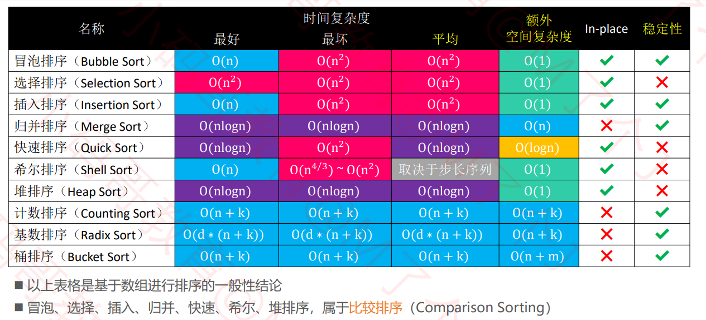
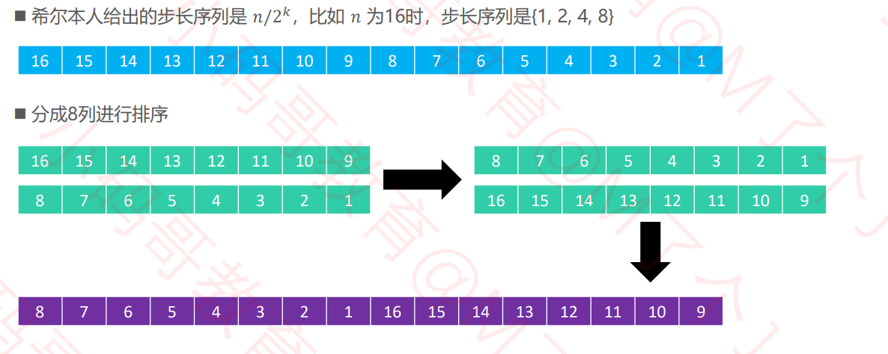
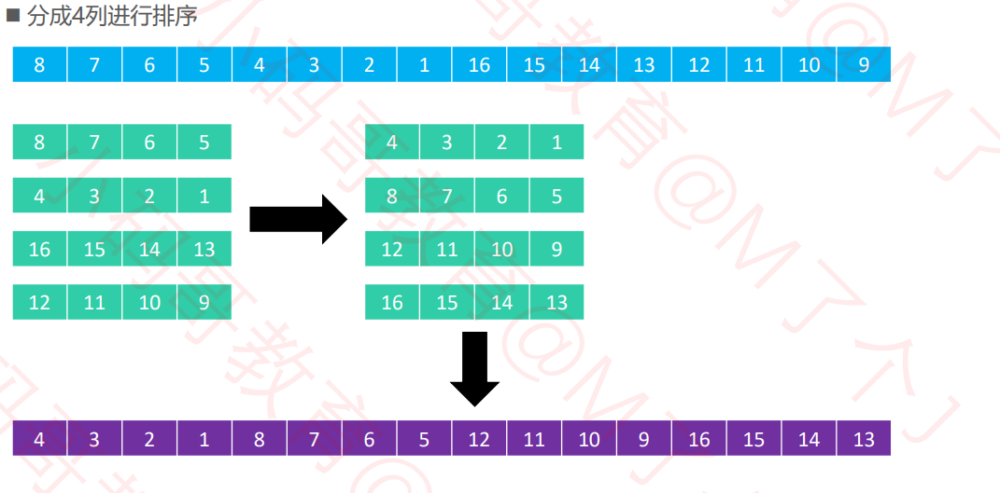
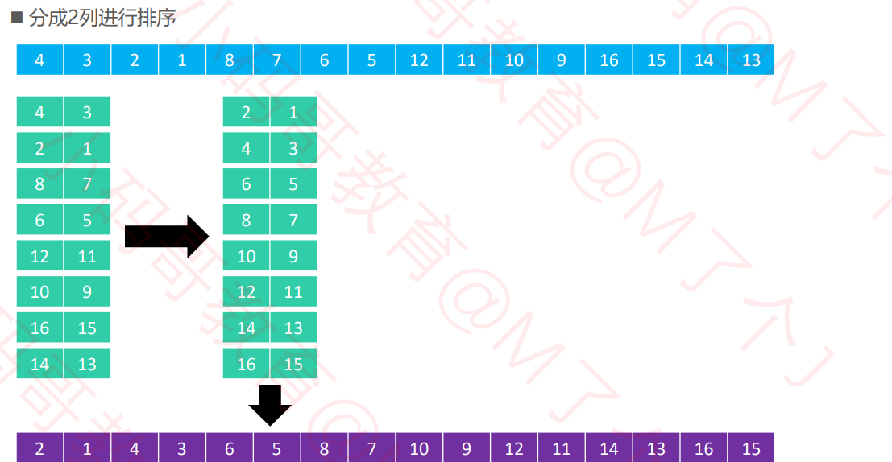
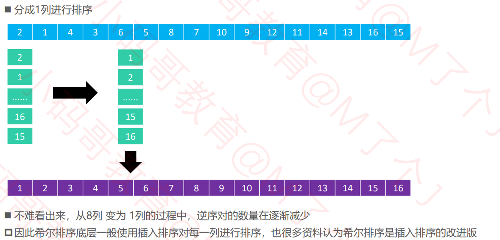
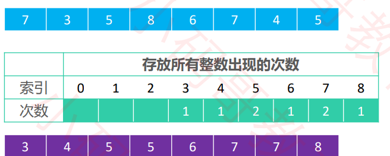
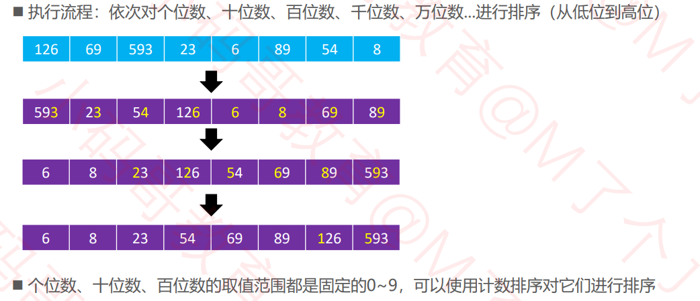
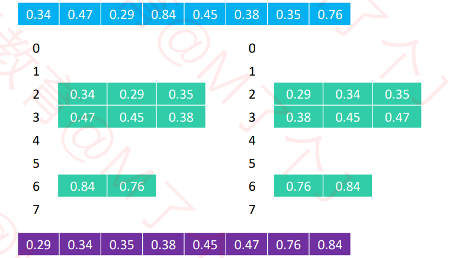

# 数据结构-排序算法篇

> 开篇：学好数据结构与算法，面到哪里都不怕。


# 一、初识排序算法



# 二、冒泡排序(Bubble Sort)

**流程：**

- 1。从头开始比较每一对相邻元素，如果第一个比第二个大，就交换它们的位置。执行完一遍，最末尾的那个元素就是最大元素。
- 2.忽略1中曾经找到的元素，重复执行1，直到全部元素都有序。

```java
public class BubbleSort {
	public static void  bubbleSort(int[]  arr) {
		if(arr.length<2||arr==null) {
			return;
		}
		
		//冒泡排序
		for(int end=arr.length-1;end>0;end--) {
			for(int i=0;i<end;i++) {
				if(arr[i]>arr[i+1]) {
					swap(arr,i,i+1);
				}
			}
		}
	}
	public static void swap(int[] arr,int i,int j) {
		int temp = arr[i];
		arr[i]   = arr[j];
		arr[j]   = temp;
	}
	
	public static void main(String[] args) {
		int[] arr = {56,9,10,19,28,37,34};
		bubbleSort(arr);
		for(int number:arr) {
			System.out.print(number + " ");
		}
	}
}
```

> 稳定性：如果相等的2个元素，在排序前后的相对位置保持不变，那么这是稳定的排序算法
>
> 其中冒泡排序是稳定的算法。
>
> 冒泡排序的平均复杂度是O(n^2),空间复杂度为O(1).


# 二、选择排序(Selection Sort)

**执行流程：**

- 1.从序列中找出最小的那个元素，然后与最首的元素交换位置 ✓ 执行完一轮后，最首尾的那个元素就是最小的元素
- 2.忽略 1中曾经找到的最小元素，重复执行步骤 ①

```java
public class SelectionSort {
	public static void selectionSort(int[] arr) {
		if(arr==null||arr.length<2) {
			return;
		}
		
		for(int i=0;i<arr.length-1;i++) {
			int minIndex = i;
			for(int j=i+1;j<arr.length;j++) {
				minIndex = arr[j]<arr[minIndex]?j:minIndex;
			}
			swap(arr,i,minIndex);
		}
	}
	
	public static void swap(int[] arr,int i,int j) {
		int temp = arr[i];
		arr[i]   = arr[j];
		arr[j]   = temp;
	}
	
	public static void main(String[] args) {
		int[] arr = {56,9,10,19,28,37,34};
		selectionSort(arr);
		for(int number:arr) {
			System.out.print(number + " ");
		}
	}
}

```

> 选择排序是不稳定算法
>
> 平均时间复杂度为O(n^2) 空间复杂度为O(1)


# 三、堆排序

可认为堆排序是对选择排序的改进。

**执行流程：**

- 1.对数组原地建立一个大顶堆
- 2.重复执行以下操作，直到堆元素为1
  - 交换堆顶元素与尾元素
  - 然后下沉

```java
// 下沉方法
	public static void siftDown(int[] arr,int parentIndex,int length) {
		int temp = arr[parentIndex];
		int childIndex = 2*parentIndex+1;
		while(childIndex<length) {
			//查看右孩子是否存在
			childIndex = childIndex+1<length&&arr[childIndex+1]>arr[childIndex]?childIndex+1:childIndex;
			if(arr[childIndex]<=temp) {
				break;
			}
			arr[parentIndex] = arr[childIndex];
			parentIndex = childIndex;
			childIndex = 2 * parentIndex + 1;
		}
		arr[parentIndex] = temp;
	}
	
	public static void heapSort(int[] arr) {
		// 1.根据数组建立一个大顶堆
		for(int i=(arr.length-1)/2;i>=0;i--) {
			// 下沉
			siftDown(arr,i,arr.length);
		}
		
		// 2.大顶堆置换到最后的索引
		for(int j=arr.length-1;j>0;j--) {
			swap(arr,0,j);
			siftDown(arr, 0, j);
		}
	}
	
	// 交换
	public static void swap(int[] arr,int i,int j) {
		int temp = arr[i];
		arr[i]   = arr[j];
		arr[j]   = temp;
	}
	
	// 主函数
	public static void main(String[] args) {
		int[] arr = {56,9,10,19,28,37,34};
		heapSort(arr);
		for(int number:arr) {
			System.out.print(number + " ");
		}
	}
```

>堆排序是不稳定算法

> 平均时间复杂度为O(nlogn) 空间复杂度为O(1)

# 四、插入排序

**执行流程**

- ·1.在执行过程中，插入排序会将序列分为2部分 ✓ 头部是已经排好序的，尾部是待排序的 
- 2. 从头开始扫描每一个元素 ✓ 每当扫描到一个元素，就将它插入到头部合适的位置，使得头部数据依然保持有序

```java
public class InsertSort {
	public static void insertSort(int[] arr) {
		if(arr==null || arr.length<2) {
			return;
		}
		for(int i=1;i<arr.length;i++) {
			for(int j=i-1;j>=0&&arr[j]>arr[j+1];j--) {
				swap(arr,j,j+1);
			}
		}
	}
	
	public static void swap(int[] arr,int i,int j) {
		int temp = arr[i];
		arr[i]   = arr[j];
		arr[j]   = temp;
	}
	// 主函数

	public static void main(String[] args) {
		int[] arr = {56,9,10,19,28,37,34};
		insertSort(arr);
		for(int number:arr) {
			System.out.print(number + " ");
		}
	}
}

```

> 优化思路：往已排序好的中插入未排序的， 那么是否可用二分搜索来找寻位置

>插入排序是不稳定算法
>
>平均时间复杂度为O(n^2) 空间复杂度为O(1)

## 补充知识点：链表的插入排序

```java
public ListNode insertionSortList(ListNode head) {
        // 链表
        if(head==null||head.next==null){
            return head;
        }
        ListNode dummy = new ListNode(-1);
        dummy.next = head;

        while(head!=null&&head.next!=null){
            // 先找到没排好序的
            if(head.val<=head.next.val){
                head = head.next;
                continue;
            }
            // 然后对其找前后
            ListNode pre = dummy;
            while(pre.next.val<head.next.val)pre=pre.next;
            ListNode cur = head.next;
            //换指针
            head.next = cur.next;
            cur.next  = pre.next;
            pre.next = cur;
        }
        return dummy.next;
    }
```

## 补充知识点：二分搜索查找

### Leetcode解法

```java
public static int  binarySearch(int[] arr,int left, int right,int target) {
  	// 求左边
    while(left<=right) {
        int mid = left + ((right-left)>>1);
        if(arr[mid]<target) {
            left = mid + 1;
        }else if(arr[mid]>=target) {
            right = mid-1;
        }
    }
    return left;
}


public static int  binarySearch(int[] arr,int left, int right,int target) {
  	// 求右边
    while(left<=right) {
        int mid = left + ((right-left)>>1);
        if(arr[mid]<=target) {
            left = mid + 1;
        }else if(arr[mid]>target) {
            right = mid-1;
        }
    }
    return right;
}


```


### 1.寻找一个数(简单的二叉搜索)

搜索一个数，如果存在，返回其索引，否则返回 -1。

```java
public static int  binarySearch(int[] arr,int target) {
    int left = 0;
    int right = arr.length-1;
    while(left<=right) {
        int mid = left + ((right-left)>>1);
        if(arr[mid]==target) {
            return mid;
        }else if(arr[mid]<target) {
            left = mid + 1;
        }else if(arr[mid]>target) {
            right = mid-1;
        }
    }
    return -1;
}
```

但存在一个缺点，比如说给你有序数组 `nums = [1,2,2,2,3]`，`target` 为 2，此算法返回的索引是 2，没错。但是如果我想得到 `target` 的左侧边界，即索引 1，或者我想得到 `target` 的右侧边界，即索引 3，这样的话此算法是无法处理的。

### 2.查找一个数的左边界

```java
	public static int left_Bound(int[] arr,int target) {
		int left = 0;
		int right = arr.length-1;
		while(left<=right) {
			// 查找中间值
			int mid = left + ((right-left)>>1);
			if(arr[mid]>target) {
				right = mid -1;
			}else if(arr[mid]<target) {
				left = mid + 1;
			}else if(arr[mid]==target) {
				// 控制边界
				right = mid-1;
			}
		}
		// 判断
		if(left>=arr.length||arr[left]!=target) {
			return -1;
		}
		return left;
	}
```

### 3.查找一个数的右边界

```java
	public static int left_Bound(int[] arr,int target) {
		int left = 0;
		int right = arr.length-1;
		while(left<=right) {
			// 查找中间值
			int mid = left + ((right-left)>>1);
			if(arr[mid]>target) {
				right = mid -1;
			}else if(arr[mid]<target) {
				left = mid + 1;
			}else if(arr[mid]==target) {
				// 控制边界
				left = mid+1;
			}
		}
		// 判断
		if(right<0 ||arr[right]!=target) {
			return -1;
		}
		return right;
	}
```


# 五、归并排序

> 执行流程：
>
> - 1.不断地将当前序列平均分割成2个子序列，直到不能在分割
> - 2.不断将2个子序列合并成一个有序序列

```java
public class MergeSort {
	public static void mergeSort(int[] arr) {
		if(arr==null||arr.length<2) {
			return;
		}
		sortProcess(arr,0,arr.length-1);
	}
	
	public static void sortProcess(int[] arr,int L,int R) {
		if(L==R){
			return;
		}
		int mid = L + ((R-L)>>1);
		sortProcess(arr, L, mid);
		sortProcess(arr, mid+1, R);
		merge(arr,L,mid,R);
	}
	
	public static void merge(int[] arr,int L,int mid,int R) {
		int p1 = L;
		int p2 = mid+1;
		int[] temp = new int[R-L+1];
		int i=0;
		while(p1<=mid&&p2<=R) {
			temp[i++] = arr[p1]<arr[p2]?arr[p1++]:arr[p2++];
		}
		while(p1<=mid) {
			temp[i++] = arr[p1++];
		}
		while(p2<=R) {
			temp[i++] = arr[p2++];
		}
		for(int j=0;j<temp.length;j++) {
			arr[L+j] = temp[j];
		}
	}
	
	// 主函数
	public static void main(String[] args) {
		int[] arr = {56,9,10,19,28,37,34};
		mergeSort(arr);
		for(int number:arr) {
			System.out.print(number + " ");
		}
	}
}

```

> 归并排序是稳定算法
>
> 平均时间复杂度为O(nlogn) 空间复杂度为O(n)

## 6.1 小和问题

在一个数组中，每一个数左边比当前数小的数累加起来，叫做这个数组的小和。求一个数组 的小和。

 例子： 

[1,3,4,2,5] 

1左边比1小的数，没有；

 3左边比3小的数，1； 

4左边比4小的数，1、3； 

2左边比2小的数，1； 

5左边比5小的数，1、3、4、2； 

所以小和为1+1+3+1+1+3+4+2=16

```java
	// 归并排序的步骤
	public static int mergeSort(int[] arr) {
		if(arr==null||arr.length<2) {
			return 0;
		}
		// 开始
		int res = sortProcess(arr,0,arr.length-1);
		return res;
	}
	
	public static int sortProcess(int[] arr,int L,int R) {
		// 递归截止条件
		if(L==R) {
			return 0;
		}
		int mid = L + ((R-L)>>1);
		
		
		// 合并
		return sortProcess(arr, L, mid) + sortProcess(arr, mid+1, R) + merge(arr,L,mid,R); 
	}
	
	// 合并 
	public static int merge(int[] arr,int L,int mid,int R) {
		int p1 = L;
		int p2 = mid+1;
		
		// 结果
		int res = 0;
		// 新建
		int[] temp = new int[R-L+1];
		int index = 0;
		while(p1<=mid&&p2<=R) {
			res			 += arr[p1]<arr[p2]?(R-p2+1)*(arr[p1]):0;
			temp[index++] = arr[p1]<arr[p2]?arr[p1++]:arr[p2++];
		}
		while(p1<=mid) {
			temp[index++] = arr[p1++];
		}
		while(p2<=R) {
			temp[index++] = arr[p2++];
		}
		// 回归
		for(int i=0;i<temp.length;i++) {
			arr[L+i] = temp[i];
		}
		
		return res;
	}
	
```

## 6.2 逆序对问题

```java
	public static int mergeSort(int[] arr) {
		if(arr==null||arr.length<2) {
			return 0;
		}
		return sortProcess(arr,0,arr.length-1);
	}
	
	public static int sortProcess(int[] arr,int L,int R) {
		if(L==R) {
			return 0;
		}
		int mid = L + ((R-L)>>1);
		int leftRes  = sortProcess(arr, L, mid);
		int rightRes = sortProcess(arr, mid+1, R);
		return leftRes + rightRes + merge(arr,L,mid,R);
	}
	
	// 合并
	public static int merge(int[] arr,int L,int mid,int R) {
		int p1 = L;
		int p2 = mid+1;
		int i = 0;
		int[] temp = new int[R-L+1];
		// 结果
		int res = 0;
		
		while(p1<=mid&&p2<=R) {
			res       += arr[p1]>arr[p2]?(mid-p1+1):0;
			temp[i++] = arr[p1]<arr[p2]?arr[p1++]:arr[p2++];
		}
		while(p1<=mid) {
			temp[i++] = arr[p1++];
		}
		while(p2<=R) {
			temp[i++] = arr[p2++];
		}
		
		for(i=0;i<temp.length;i++) {
			arr[L+i] = temp[i];
		}
		
		return res;
	}
```


## 6.3 合并两个有序数组

```java
public void merge(int[] nums1, int m, int[] nums2, int n) {
        int p1 = 0;
        int p2 = 0;
        // 开辟一个新的数组
        int[] temp = new int[m+n];
        int i  = 0;
        // 开始
        while(p1<=m-1&&p2<=n-1){
            temp[i++] = nums1[p1]<nums2[p2]?nums1[p1++]:nums2[p2++];
        }
        while(p1<=m-1){
            temp[i++] = nums1[p1++];
        }
        while(p2<=n-1){
            temp[i++] = nums2[p2++];
        }
        // 最终
        for(i=0;i<temp.length;i++){
            nums1[i] = temp[i];
        }
    }
```


## 6.4 合并两个有序链表

```java
public ListNode mergeTwoLists(ListNode l1, ListNode l2) {
        ListNode dummy = new ListNode(-1);
        ListNode pre = dummy;
        // 对其遍历
        while(l1!=null&&l2!=null){
            if(l1.val<l2.val){
                pre.next = l1;
                l1 = l1.next;
                pre = pre.next;
            }else{
                pre.next = l2;
                l2 = l2.next;
                pre = pre.next;
            }
        }

        pre.next = l1!=null?l1:l2;
        return dummy.next;
    }
```


## 6.5 合并K个有序链表

给你一个链表数组，每个链表都已经按升序排列。

请你将所有链表合并到一个升序链表中，返回合并后的链表。

```java
// 新建封装类
    class Status implements Comparable<Status>{
        int val;
        ListNode node;

        Status(int val,ListNode node){
            this.val = val;
            this.node = node;
        }

        public int compareTo(Status status2){
            return this.val - status2.val;
        }
    }
    public ListNode mergeKLists(ListNode[] lists) {
        if(lists==null){
            return null;
        }
        if(lists.length==1){
            return lists[0];
        }
        // 优先级队列  小顶堆
        PriorityQueue<Status> queue = new PriorityQueue<>();
        // 入队列
        for(int i=0;i<lists.length;i++){
            if(lists[i]!=null){
                queue.offer(new Status(lists[i].val,lists[i]));
            }
        }

        // 合并K个链表
        ListNode dummy = new ListNode(-1);
        ListNode pre   = dummy;
        // 对其遍历
        while(!queue.isEmpty()){
            Status status = queue.poll();
            pre.next = status.node;
            pre = pre.next;
            // 判断是否还有
            if(status.node.next!=null){
                queue.offer(new Status(status.node.next.val,status.node.next));
            }
        }

        return dummy.next;
    }
```

## 6.6 链表归并排序

```java
public ListNode sortList(ListNode head) {
        return mergeSort(head,null);
    }
    public ListNode mergeSort(ListNode head,ListNode tail){
        // 截止条件
        if(head==null){
            return null;
        }
        if(head.next==tail){
            head.next = null;
            return head;
        }

        // 找mid
        // 快慢指针
        ListNode slow = head,fast = head;
        while(fast!=tail&&fast.next!=tail){
            slow = slow.next;
            fast = fast.next.next;
        }
        ListNode mid = slow;
        ListNode left = mergeSort(head,mid);
        ListNode right = mergeSort(mid,tail);
        ListNode sorted =  merge(left,right);
        return sorted;
    }

    // 合并两个有序链表
    public ListNode merge(ListNode head1,ListNode head2){
        ListNode dummy = new ListNode(-1);
        ListNode pre = dummy;

        while(head1!=null&&head2!=null){
            if(head1.val<head2.val){
                pre.next = head1;
                head1 = head1.next;
                pre = pre.next;
            }else{
                pre.next = head2;
                head2 = head2.next;
                pre = pre.next;
            }
        }

        pre.next = head1!=null?head1:head2;
        return dummy.next;
    }
```

# 六、快速排序

## 6.1 二分问题 移动0

给定一个数组 nums，编写一个函数将所有 0 移动到数组的末尾，同时保持非零元素的相对顺序。

示例:

输入: [0,1,0,3,12]
输出: [1,3,12,0,0]
说明:

必须在原数组上操作，不能拷贝额外的数组。
尽量减少操作次数。

```java
// 移动0的二分问题
	public static void moveZero(int[] arr) {
		if(arr==null||arr.length<2) {
			return;
		}
		
		int less = -1;
		int cur  =0;
		while(cur<arr.length) {
			if(arr[cur]==0) {
				cur++;
			}else {
				swap(arr,++less,cur);
			}
		}
	}
	
	// 交换
	public static void  swap(int[] arr,int i,int j) {
		arr[i] = arr[i]^arr[j];
		arr[j] = arr[j]^arr[i];
		arr[i] = arr[i]^arr[j];
	}
```


## 6.2 荷兰国旗问题

给定一个数组arr,和一个数num,请把小于num的数放在数组的左边, 等于num的数放在数组的中间，大于num的数放在数组的右边。要求时间复杂度为O(N)

```java
// 三分问题
	public static void three_process(int[] arr,int number) {
		if(arr==null||arr.length<2) {
			return;
		}
		process(arr,0,arr.length-1,number);
	}
	public static void process(int[] arr,int L,int R,int number) {
		
		int less = L-1;
		int more = R+1;
		while(L<more) {
			if(arr[L]<number) {
				swap(arr,++less,L++);
			}else if(arr[L]>number) {
				swap(arr,--more,L);
			}else if(arr[L]==number) {
				L++;
			}
		}
	}
```


## 6.3 快速排序问题

```java
public static void quickSort(int[] arr) {
		if(arr==null||arr.length<2) {
			return;
		}
		quickSort(arr,0,arr.length-1);
	}
	
	public static void quickSort(int[] arr,int L,int R) {
		if(L<R) {
            // 随机排序
            //swap(arr,L+(int)(Math.random()*(R-L+1)),R);
			int[] p = partition(arr,L,R);
			quickSort(arr,L,p[0]-1);
			quickSort(arr,p[1]+1,R);
		}
	}
	
	public static int[] partition(int[] arr,int L,int R) {
		int less = L-1;
		int more = R;
		while(L<more) {
			if(arr[L]<arr[R]) {
				swap(arr,++less,L++);
			}else if(arr[L]>arr[R]) {
				swap(arr,--more,L);
			}else{
				L++;
			}
		}
		swap(arr,more,R);
		return new int[] {less+1,more};
	}
	
```

> 快速排序不稳定排序
>
> O(nlogn)  O（logn）

## 6.4 快速排序-链表

```java
class Solution {
		// O(nlogn)的时间复杂度 归并排序
	    public ListNode sortList(ListNode head) {
	    	// 判断
	    	if(head==null || head.next==null) {
	    		return head;
	    	}
	    	ListNode dummy = new ListNode(-1);
	    	dummy.next = head;
	    	return quickSort(dummy,null);
	    }	
	    
	    public ListNode quickSort(ListNode head,ListNode tail) {
	    	if(head==tail||head.next==tail||head.next.next==tail) {
	    		return head;
	    	}
	    	// 将小于划分点的值存放在临时链表中
	    	ListNode tempHead = new ListNode(-1);
	    	ListNode tp = tempHead;//指针
	    	ListNode partitaion = head.next;//划分点
	    	ListNode p = head.next; // 遍历的指针
	    	
	    	// 开始
	    	while(p.next!=tail) {
	    		// 小于
	    		if(p.next.val<partitaion.val) {
	    			tp.next = p.next;
	    			tp = tp.next;
	    			p.next = p.next.next;
	    		}else {
	    			p = p.next;
	    		}
	    	}
	    	
	    	// 合并临时链表和原链表
	    	tp.next = head.next;
	    	// 将临时链表
	    	head.next = tempHead.next;
	    	// 最后
	    	quickSort(head, partitaion);
	    	quickSort(partitaion, tail);
	    	return head.next;
	    }
	}
```


# 七、希尔排序(了解)

**流程**

希尔排序把序列看作是一个矩阵，分成 𝑚 列，逐列进行排序 𝑚 从某个整数逐渐减为1 当 𝑚 为1时，整个序列将完全有序

**实例**









```java

public class ShellSort<T extends Comparable<T>> extends Sort<T> {

	@Override
	protected void sort() {
		List<Integer> stepSequence = sedgewickStepSequence();
		for (Integer step : stepSequence) {
			sort(step);
		}
	}
	
	/**
	 * 分成step列进行排序
	 */
	private void sort(int step) {
		// col : 第几列，column的简称
		for (int col = 0; col < step; col++) { // 对第col列进行排序
			// col、col+step、col+2*step、col+3*step
			for (int begin = col + step; begin < array.length; begin += step) {
				int cur = begin;
				while (cur > col && cmp(cur, cur - step) < 0) {
					swap(cur, cur - step);
					cur -= step;
				}
			}
		}
	}
	
	private List<Integer> shellStepSequence() {
		List<Integer> stepSequence = new ArrayList<>();
		int step = array.length;
		while ((step >>= 1) > 0) {
			stepSequence.add(step);
		}
		return stepSequence;
	}
	
	private List<Integer> sedgewickStepSequence() {
		List<Integer> stepSequence = new LinkedList<>();
		int k = 0, step = 0;
		while (true) {
			if (k % 2 == 0) {
				int pow = (int) Math.pow(2, k >> 1);
				step = 1 + 9 * (pow * pow - pow);
			} else {
				int pow1 = (int) Math.pow(2, (k - 1) >> 1);
				int pow2 = (int) Math.pow(2, (k + 1) >> 1);
				step = 1 + 8 * pow1 * pow2 - 6 * pow2;
			}
			if (step >= array.length) break;
			stepSequence.add(0, step);
			k++;
		}
		return stepSequence;
	}
}

```


冒泡、选择、插入、归并、快速、希尔、堆排序，都是基于比较的排序

计数排序、桶排序、基数排序，都不是基于比较的排序

它们是典型的用空间换时间，在某些时候，平均时间复杂度可以比 O nlogn 更低

# 八、计数排序(了解)

统计每个整数在序列中出现的次数，进而推导出每个整数在有序序列中的索引。



```java
protected void sort0() {
		// 找出最大值
		int max = array[0];
		for (int i = 1; i < array.length; i++) {
			if (array[i] > max) {
				max = array[i];
			}
		} // O(n)
		
		// 开辟内存空间，存储每个整数出现的次数
		int[] counts = new int[1 + max];
		// 统计每个整数出现的次数
		for (int i = 0; i < array.length; i++) {
			counts[array[i]]++;
		} // O(n)
		
		// 根据整数的出现次数，对整数进行排序
		int index = 0;
		for (int i = 0; i < counts.length; i++) {
			while (counts[i]-- > 0) {
				array[index++] = i;
			}
		} // O(n)
```

# 九、基数排序(了解)

- 基数排序非常适合用于整数排序



```java
rotected void sort() {
		// 找出最大值
		int max = array[0];
		for (int i = 1; i < array.length; i++) {
			if (array[i] > max) {
				max = array[i];
			}
		}
		
		// 个位数: array[i] / 1 % 10 = 3
		// 十位数：array[i] / 10 % 10 = 9
		// 百位数：array[i] / 100 % 10 = 5
		// 千位数：array[i] / 1000 % 10 = ...

		for (int divider = 1; divider <= max; divider *= 10) {
			countingSort(divider);
		}
	}
	
	protected void countingSort(int divider) {
		// 开辟内存空间，存储次数
		int[] counts = new int[10];
		// 统计每个整数出现的次数
		for (int i = 0; i < array.length; i++) {
			counts[array[i] / divider % 10]++;
		}
		// 累加次数
		for (int i = 1; i < counts.length; i++) {
			counts[i] += counts[i - 1];
		}
		
		// 从后往前遍历元素，将它放到有序数组中的合适位置
		int[] newArray = new int[array.length];
		for (int i = array.length - 1; i >= 0; i--) {
			newArray[--counts[array[i] / divider % 10]] = array[i];
		}
		
		// 将有序数组赋值到array
		for (int i = 0; i < newArray.length; i++) {
			array[i] = newArray[i];
		}
	}
```

# 十、桶排序

**执行流程** 

① 创建一定数量的桶（比如用数组、链表作为桶） 

② 按照一定的规则（不同类型的数据，规则不同），将序列中的元素均匀分配到对应的桶 

③ 分别对每个桶进行单独排序 

④ 将所有非空桶的元素合并成有序序列



## 10.1 利用桶排序排序后最大差值问题

> 题目：给定个数组，求如果排序之后，相邻两数的最大差值,要求时间复杂度O(N),且要求不能用非基于比较的排序。

给出三个桶，放最大值 最小值 是否有值 平均分配桶

```java
package com.lcz.leetcode;
import java.util.*;

public class MaxGap {
	// 求最大差值 用桶排序
	public static int maxGap(int[] nums) {
		if(nums==null || nums.length<2) {
			return 0;
		}
		int len = nums.length;
		int min = Integer.MAX_VALUE;
		int max = Integer.MIN_VALUE;
		for(int i=0;i<len;i++) {
			min = Math.min(min, nums[i]);
			max = Math.max(max, nums[i]);
		}
		if(min==max) {
			return 0;
		}
		// 放入桶中
		boolean[] hasNum = new boolean[len+1];
		int[] maxs = new int[len+1];
		int[] mins = new int[len+1];
		int bid = 0;
		for(int i=0;i<len;i++) {
			bid = bucket(nums[i], len, min, max);
			mins[bid] = hasNum[bid]?Math.min(mins[bid], nums[i]):nums[i];
			maxs[bid] = hasNum[bid]?Math.max(maxs[bid], nums[i]):nums[i];
			hasNum[bid] =  true;
		}
		// 得到结果
		int res = 0;
		int lastMax = maxs[0];
		for(int i=1;i<=len;i++) {
			if(hasNum[i]) {
				res = Math.max(res, mins[i]-lastMax);
				lastMax = maxs[i];
			}
		}
		return res;
	}
	
	// 确定哪个桶
	public static int bucket(long num,long len,long min,long max) {
		return (int)((num-min)*len / (max-min));
	}
	
	
	// 标准方法
	public static int comparator(int[] nums) {
		if(nums==null||nums.length<2) {
			return 0;
		}
		// 对其排序
		Arrays.sort(nums);
		// 求最大差值
		int gap = Integer.MIN_VALUE;
		for(int i=1;i<nums.length;i++) {
			gap = Math.max(nums[i]-nums[i-1], gap);
		}
		return gap;
	}
	// 主函数
	public static void main(String[] args) {
		int[] arr = new int[] {1,3,2,6,5,7,8,9,0};
//		System.out.println(comparator(arr));
		System.out.println(maxGap(arr));
	}
}

```

# 总结、工程中的综合排序算法

- 基础类型，对于稳定性要求不高
  - 对于少于60个的，直接用插入排序。虽然插入排序是O(n^2),但是这是在忽略常数项得到的。在60以内，插入排序的劣势体现不出来，其常数项很低。如果一开始数组容量很大，可分治处理，分治后小于60个采用这个。
  - 对于大于60的，用快速排序
- 自定义类型对于稳定性有要求，因此用归并排序，因为需要保持原始顺序。

# 轶事-休眠排序

```java
	// 休眠排序
	private static class SortThread extends Thread{
		private int value;
		public SortThread(int value) {
			this.value = value;
		}
		public void run() {
			try {
				Thread.sleep(value);
				System.out.println(value);
			}catch (InterruptedException e) {
				e.printStackTrace();
			}
		}
	}
	
	// 主函数
	public static void main(String[] args) {
		int[] arr = {10,100,50,30,60};
		for(int i=0;i<arr.length;i++) {
			new SortThread(arr[i]).start();
		}
	}
}

```

