# 冒泡算法 O(n^2)

> 找到end位置
>
> 相邻两两元素比较,使数组中最大的元素浮到最后一位，之后再继续两两比较，使数组中倒数第二大元素浮到倒数第二位, 以此类推。

```java
public static void bubbleSort(int[] arr){
    if(arr == null || arr.length < 2){
        return;
    }
    for(int end=arr.length;end>0;end--){
        for(int i=0;i<end;i++){
            if(arr[i]>arr[i+1]){
                swap(arr,i,i+1);
            }
        }
    }
}

public static void swap(int[] arr,int i,int j){
    int temp = arr[i];
    arr[i] = arr[j];
    arr[j] = temp;
}
```

# 选择排序O(n^2)

> 考察整个数组, 从整个数组中选择最低位, 与后面位置元素相比较，将最小元素放置在第一位。

```java
public static void selectionSort(int[] arr){
    if(arr==null||arr.length<2){
        return;
    }
    for(int i=0;i<arr.length-1;i++){
        int minIndex = i;
        for(int j=i+1;j<arr.length;j++){
            minIndex = arr[j]<arr[minIndex]?j:minIndex;
        }
        swap(arr,i,minIndex);
    }
}
public static void swap(int[] arr,int i,int j){
    int temp = arr[i];
    arr[i] = arr[j];
    arr[j] = temp;
}
```

# 插入排序O(n^2)

考察index位置

```java
public static void insertionSort(int[] arr){
	if (arr == null || arr.length < 2){
        return;
    }
    for(int i=1;i<arr.length;i++){
        for(int j=i-1;j>=0&&arr[j]>arr[j+1];j--){
            swap(arr,j,j+1);
        }
    }
}

public static void swap(int[] arr,int i,int j){
    arr[i] = arr[i] ^ arr[j];
    arr[j] = arr[j] ^ arr[i];
    arr[i] = arr[i] ^ arr[j];
    //int temp = arr[i];
    //arr[i] = arr[j];
    //arr[j] = temp;
}
```

# 归并排序O(n*logn)

```java
 public static void mergeSort(int[] arr){
     if(arr == null || arr.length < 2){
         return;
     }
     sortProcess(arr,0,arr.length-1);
 }

public static void sortProcess(int[] arr,int L,int R){
    if(L==R){
        return;
    }
    int mid = L + ((R-L)>>1);
    sortProcess(arr,L,mid);
    sortProcess(arr,mid+1,R);
    merge(arr,L,mid,R);
}

public static void merge(int[] arr,int L,int mid,int R){
    int[] temp = new int[R-L+1];
    int i = 0;
    int p1 = L;
    int p2 = mid + 1;
    while(p1<=mid&&p2<=R){
        temp[i++] = arr[p1] < arr[p2] ? arr[p1++]:arr[p2++];
    }
    while(p1<=mid){
        temp[i++] = arr[p1++];
    }
    while(p2<=R){
        temp[i++] = arr[p2++];
    }
    for(i=0;i<temp.length;i++){
        arr[L+i] = temp[i];
    }
}
```

## 归并排序-小和问题

```java
public static int smallSum(int[] arr) {
		if(arr==null||arr.length<2) {
			return 0;
		}
		return mergeSort_2(arr,0,arr.length-1);
	}
	
	public static int mergeSort_2(int[] arr,int L,int R) {
		// 终止条件
		if(L==R) {
			return 0;
		}
		int mid = L + ((R-L)>>1);
		return mergeSort_2(arr,L,mid) + mergeSort_2(arr,mid+1,R)+merge_2(arr,L,mid,R);
	}
	public static int merge_2(int[] arr,int L,int mid,int R) {
		int[] temp = new int[R-L+1];
		int i = 0;
		int p1 = L;
		int p2 = mid+1;
		int res = 0;
		while(p1<=mid&&p2<=R) {
			res += arr[p1]<arr[p2]?(R-p2+1)*arr[p1]:0;
			temp[i++] = arr[p1]<arr[p2]?arr[p1++]:arr[p2++];
		}
		while(p1<=mid) {
			temp[i++] = arr[p1++];
		}
		while(p2<=R) {
			temp[i++] = arr[p2++];
		}
		for(i=0;i<temp.length;i++) {
			arr[L+i] = temp[i];
		}
		return res;
	}
```


## 归并排序-逆序对问题

```java
public int reversePairs(int[] nums) {
			if(nums==null||nums.length<2) {
				return 0;
			}
			return mergeSort(nums,0,nums.length-1);
		}
		
		public  int mergeSort(int[] nums,int L,int R) {
			// 终止条件
			if(L==R) {
				return 0;
			}
			int mid = L + ((R-L)>>1);
			int leftPairs = mergeSort(nums, L, mid);
			int rightPairs = mergeSort(nums, mid+1, R);
			if(nums[mid]<=nums[mid+1]) {
				return leftPairs+rightPairs;
			}
			int crossPairs = merge(nums,L,mid,R);
			return leftPairs+rightPairs+crossPairs;
		}
		
		public  int merge(int[] arr,int L,int mid,int R) {
			int[] temp = new int[R-L+1];
			int res = 0;
			int i = 0;
			int p1 = L;
			int p2 = mid+1;
			while(p1<=mid&&p2<=R) {
				res += arr[p1]>arr[p2]?(mid-p1+1):0;
				temp[i++] = arr[p1]<=arr[p2]?arr[p1++]:arr[p2++];
			}
			while(p1<=mid) {
				temp[i++] = arr[p1++];
			}
			while(p2<=R) {
				temp[i++] = arr[p2++];
			}
			for(i=0;i<temp.length;i++) {
				arr[i+L] = temp[i];
			}
			return res;
		}
	}
```

# 快速排序-荷兰国旗问题

二分问题

给定一个数组a和一个数n，把小于等于n的数字放在数组的左边，大于n的数放在数组的右边，要求额外空间复杂度O(1)，时间复杂度O(n)

>1、首先定义两个下标：
>下标1：less=-1，表示<=n的区域；
>下标2：p=0，表示当前值所在位置。
>2、接着进行判断：
>1）当前值<=划分值n（也叫基准值/枢轴），则当前数与<=区域的下一个数交换，然后<=区域扩大一位（即less+1），并且当前值指针p跳下一个
>2）当前值>n，则当前值指针p直接跳下一个

> 移动0
>
> 给定一个数组 nums，编写一个函数将所有 0 移动到数组的末尾，同时保持非零元素的相对顺序。
>
> 示例:
>
> 输入: [0,1,0,3,12]
> 输出: [1,3,12,0,0]
> 说明:
>
> 必须在原数组上操作，不能拷贝额外的数组。
> 尽量减少操作次数。

```java
class Solution {
    public void moveZeroes(int[] nums) {

        // 二分、荷兰国旗、快排问题
        int less = -1;
        int cur = 0;
        while(cur<nums.length){
            if(nums[cur]==0){
                cur++;
            }else{
                // 交换
                swap(nums,++less,cur++);
            }
        }
    }

    public void swap(int[] arr,int i,int j){
        int temp = arr[i];
        arr[i] = arr[j];
        arr[j] = temp;
    }
}
```


> 给定一个数组arr,和一个数num,请把小于num的数放在数组的左边, 等于num的数放在数组的中间，大于num的数放在数组的右边。要求时间复杂度为O(N)

```java
public static int[] partition(int arr[],int L,int R){
    int less = L-1;
    int more = R+1;
    while(L<more){
        if(arr[L]<num){
            swap(arr,++less,L++);
        }else if(arr[L]>num){
            swap(arr,--more,L);
        }else{
            L++;
        }
    }
    return new int[]{less+1,more-1};
}
```


## 快速排序O(n*logn)

```java
public class QucikSort {
	public static void quickSort(int[] arr) {
		if(arr==null||arr.length<2) {
			return;
		}
		quickSort(arr,0,arr.length-1);
	}
	public static void quickSort(int[] arr,int L,int R) {
		if(L<R) {
			int[] p = partition(arr,L,R);
			quickSort(arr,L,p[0]-1);
			quickSort(arr,p[1]+1,R);
		}
	}
	
	public static int[] partition(int[] arr,int L,int R) {
		int less = L-1;
		int more = R;
		while(L<more) {
			if(arr[L]<arr[R]) {
				swap(arr,++less,L++);
			}else if(arr[L]>arr[R]) {
				swap(arr,--more,L);
			}else {
				L++;
			}
		}
		swap(arr,more,R);
		return new int[] {less+1,more};
	}
	
	public static void swap(int[] arr,int i,int j) {
		int temp = arr[i];
		arr[i] = arr[j];
		arr[j] = temp;
	}
```


## 随机快速排序o(nlogn)

```java
public class QucikSort {
	public static void quickSort(int[] arr) {
		if(arr==null||arr.length<2) {
			return;
		}
		quickSort(arr,0,arr.length-1);
	}
	public static void quickSort(int[] arr,int L,int R) {
		if(L<R) {
			swap(arr, l + (int) (Math.random() * (r - l + 1)), r);
			int[] p = partition(arr,L,R);
			quickSort(arr,L,p[0]-1);
			quickSort(arr,p[1]+1,R);
		}
	}
	
	public static int[] partition(int[] arr,int L,int R) {
		int less = L-1;
		int more = R;
		while(L<more) {
			if(arr[L]<arr[R]) {
				swap(arr,++less,L++);
			}else if(arr[L]>arr[R]) {
				swap(arr,--more,L);
			}else {
				L++;
			}
		}
		swap(arr,more,R);
		return new int[] {less+1,more};
	}
	
	public static void swap(int[] arr,int i,int j) {
		int temp = arr[i];
		arr[i] = arr[j];
		arr[j] = temp;
	}
```

# 堆排序O(nlogn)

```java
// 下沉操作
	public static void downAdjust(int[] arr,int parentIndex,int length) {
		int temp = arr[parentIndex];
		int childIndex = 2*parentIndex + 1;
		while(childIndex<length) {
			// 如果有孩子且右孩子大于左孩子的值
			childIndex = childIndex+1<length&&arr[childIndex+1]>arr[childIndex]?childIndex+1:childIndex;
			if(temp>=arr[childIndex]) {
				break;
			}
			arr[parentIndex] = arr[childIndex];
			parentIndex = childIndex;
			childIndex = 2*childIndex+1;
		}
		arr[parentIndex] = temp;
	}
	
	// 堆排序
	public static void heapSort(int[] arr) {
		// 1.把无序数组转为大顶堆
		for(int i=(arr.length-2)/2;i>=0;i--) {
			downAdjust(arr,i,arr.length);
		}
		//2.循环删掉栈顶元素，移动集合尾部，调整堆
		for(int i=arr.length-1;i>0;i--) {
			swap(arr,0,i);
			downAdjust(arr, 0, i);
		}
	}
	
	// 主函数
	public static void main(String[] args) {
		int[] arr = new int[] {1,3,2,6,5,7,8,9,0};
		heapSort(arr);
		System.out.println(Arrays.toString(arr));
	}
	
	// 交换操作
	public static void swap(int[] arr,int i,int j) {
		int temp = arr[i];
		arr[i] = arr[j];
		arr[j] = temp;
	}
```


# 排序算法的稳定性以及汇总

这里稳定性是指值为一样的值，经过排序之后，索引相对顺序是否改变

- 冒泡算法-稳定
- 选择算法-不稳定
- 插入算法-稳定
- 归并排序-稳定
- 快排-不稳定
- 堆-不稳定


> - 归并排序的额外空间复杂度可以变为O(1), 但是非常难, 不需要掌握，可以搜“归并排序，内部缓存法”
> - 快速排序也可以做到稳定性问题，但是非常难，不需要掌握，可以搜下“01 stable sort”
> - 有道题目，是奇数放在数组左边，偶数放在数组右边，还要求原始的相对次序不变，这个问题是01 stable sort问题。


# 比较器


# 桶排序、计数排序、基数排序的介绍

> - 都是非基于比较的排序，与被排序的样本的实际数据状况很有关系，实际中并不常用
> - 时间复杂度O(N)  额外空间复杂度O(N)
> - 稳定的排序

# 补充

> 题目：给定个数组，求如果排序之后，相邻两数的最大差值,要求时间复杂度O(N),且要求不能用非基于比较的排序。

```java
package com.lcz.leetcode;
import java.util.*;

public class MaxGap {
	// 求最大差值 用桶排序
	public static int maxGap(int[] nums) {
		if(nums==null || nums.length<2) {
			return 0;
		}
		int len = nums.length;
		int min = Integer.MAX_VALUE;
		int max = Integer.MIN_VALUE;
		for(int i=0;i<len;i++) {
			min = Math.min(min, nums[i]);
			max = Math.max(max, nums[i]);
		}
		if(min==max) {
			return 0;
		}
		// 放入桶中
		boolean[] hasNum = new boolean[len+1];
		int[] maxs = new int[len+1];
		int[] mins = new int[len+1];
		int bid = 0;
		for(int i=0;i<len;i++) {
			bid = bucket(nums[i], len, min, max);
			mins[bid] = hasNum[bid]?Math.min(mins[bid], nums[i]):nums[i];
			maxs[bid] = hasNum[bid]?Math.max(maxs[bid], nums[i]):nums[i];
			hasNum[bid] =  true;
		}
		// 得到结果
		int res = 0;
		int lastMax = maxs[0];
		for(int i=1;i<=len;i++) {
			if(hasNum[i]) {
				res = Math.max(res, mins[i]-lastMax);
				lastMax = maxs[i];
			}
		}
		return res;
	}
	
	// 确定哪个桶
	public static int bucket(long num,long len,long min,long max) {
		return (int)((num-min)*len / (max-min));
	}
	
	
	// 标准方法
	public static int comparator(int[] nums) {
		if(nums==null||nums.length<2) {
			return 0;
		}
		// 对其排序
		Arrays.sort(nums);
		// 求最大差值
		int gap = Integer.MIN_VALUE;
		for(int i=1;i<nums.length;i++) {
			gap = Math.max(nums[i]-nums[i-1], gap);
		}
		return gap;
	}
	// 主函数
	public static void main(String[] args) {
		int[] arr = new int[] {1,3,2,6,5,7,8,9,0};
//		System.out.println(comparator(arr));
		System.out.println(maxGap(arr));
	}
}

```

# 介绍工程中的综合排序算法

- 少于60个数直接用插入排序 虽然插入排序是O(n^2)但是在忽略常数项得到的，在60以内，插入排序的劣势体现不出来，其排序常数项很低，在小样本情况下，插入很大. 如果一开始数组容量大，可以分治处理，分治后小于60采取这个。
- 基础类型用快速排序
- 自定义类型用归并类型，因为需要保持原始排序


# 堆和栈

## 题目一、用数组结构实现大小固定的队列和栈

```
public class Array_To_Stack_Queue {
	// 用数组模拟栈
	public static class ArrayStack{
		private Integer[] arr;
		private Integer size;
		
		// 构造函数
		public ArrayStack(int initSize) {
			if(initSize<0) {
				throw new IllegalArgumentException("The init size is less than 0");
			}
			arr = new Integer[initSize];
			size = 0;
		}
		
		// 数据入
		public void push(int obj) {
			if(size==arr.length) {
				throw new ArrayIndexOutOfBoundsException("The queue is full");
			}
			arr[size++] = obj;
		}
		
		// 数据出
		public Integer pop() {
			if(size==0) {
				throw new ArrayIndexOutOfBoundsException("The queue is empty");
			}
			return arr[--size];
		}
		
		// 顶峰
		public Integer peek() {
			if(size==0) {
				throw new ArrayIndexOutOfBoundsException("The queue is empty");
			}
			return arr[size-1];
		}
	}
	
	
	// 用数组模拟队列
	public static class ArrayQueue{
		private Integer[] arr;
		private Integer size;
		private Integer first;
		private Integer last;
		
		// 构造函数
		public ArrayQueue(int initSize) {
			if(initSize<0) {
				throw new IllegalArgumentException("The init size is less than 0");
			}
			arr = new Integer[initSize];
			size = 0;
			first = 0;
			last = 0;
		}
		
		// 队列添加数值
		public void offer(Integer obj) {
			if(size==arr.length) {
				throw new ArrayIndexOutOfBoundsException("The queue is full");
			}
			size++;
			arr[last] = obj;
			last = last==arr.length-1?0:last+1;
		}
		// 从队列中拿出数值
		public Integer poll() {
			if(size==0) {
				throw new ArrayIndexOutOfBoundsException("The queue is empty");
			}
			size--;
			int temp = first;
			first = first==arr.length-1?0:first+1;
			return arr[temp];
		}
		
		// 偷瞄一眼
		public Integer peek() {
			if(size==0) {
				return null;
			}
			return arr[first];
		}
	}
}

```

## 题目二、实现一个特殊的栈

实现一个特殊的栈，在实现栈的基本功能的基础上，再实现返回栈中最小元素的操作。

要求：

- pop push getMin操作的时间复杂度都是O(1)
- 设计的栈类型可以使用现成的栈结构

```java
public class GteMinStack {
	
	public class MinStack{
		// 成员变量
		private Stack<Integer> stackData;
		private Stack<Integer> stackMin;
		
		// 初始化
		public MinStack() {
			this.stackData = new Stack<Integer>();
			this.stackMin = new Stack<Integer>();
		}
		
		// 获取最小值
		public int getMin() {
			if(this.stackMin.isEmpty()) {
				throw new RuntimeException("your stack is empty");
			}
			return this.stackMin.peek();
		}
		
		// push
		public void push(Integer obj) {
			if(this.stackMin.isEmpty()) {
				this.stackMin.push(obj);
			}else if(obj<this.getMin()) {
				this.stackMin.push(obj);
			}else if(obj>=this.getMin()) {
				int newMin = this.stackMin.peek();
				this.stackMin.push(newMin);
			}
			this.stackData.push(obj);
		}
		// pop
		public int pop() {
			if(this.stackData.isEmpty()) {
				throw new RuntimeException("your stack is empty");
			}
			this.stackMin.pop();
			return this.stackData.pop();
		}
	}
}

```

## 题目三、用队列模拟栈  用栈模拟队列

队列模拟栈

```java
public static class QueueConvertStack{
		// 成员变量
		private Queue<Integer> queue_in;
		private Queue<Integer> queue_out;
		
		// 构造函数
		public QueueConvertStack() {
			this.queue_in = new LinkedList<Integer>();
			this.queue_out = new LinkedList<Integer>();
		}
		
		// 入栈
		public void push(Integer obj) {
			this.queue_in.offer(obj);
		}
		
		// 出栈
		public int pop() {
			if(this.queue_in.isEmpty()) {
				throw new RuntimeException("stack is empty");
			}
			while(this.queue_in.size()!=1) {
				this.queue_out.offer(this.queue_in.poll());
			}
			int res = this.queue_in.poll();
			// 交换
			Queue<Integer> temp = this.queue_in;
			this.queue_in = this.queue_out;
			this.queue_out = temp;
			
 			return res;
		}
		
		// 瞥一眼
		public int peek() {
			if(this.queue_in.isEmpty()) {
				throw new RuntimeException("stack is empty");
			}
			while(this.queue_in.size()!=1) {
				this.queue_out.offer(this.queue_in.poll());
			}
			int res = this.queue_in.poll();
			this.queue_out.offer(res);
			// 交换
			Queue<Integer> temp = this.queue_in;
			this.queue_in = this.queue_out;
			this.queue_out = temp;
			
 			return res;
		}
	}
```


栈模拟队列

```java
public static class QueueConvertStack{
		// 成员变量
		private Queue<Integer> queue_in;
		private Queue<Integer> queue_out;
		
		// 构造函数
		public QueueConvertStack() {
			this.queue_in = new LinkedList<Integer>();
			this.queue_out = new LinkedList<Integer>();
		}
		
		// 入栈
		public void push(Integer obj) {
			this.queue_in.offer(obj);
		}
		
		// 出栈
		public int pop() {
			if(this.queue_in.isEmpty()) {
				throw new RuntimeException("stack is empty");
			}
			while(this.queue_in.size()!=1) {
				this.queue_out.offer(this.queue_in.poll());
			}
			int res = this.queue_in.poll();
			// 交换
			Queue<Integer> temp = this.queue_in;
			this.queue_in = this.queue_out;
			this.queue_out = temp;
			
 			return res;
		}
		
		// 瞥一眼
		public int peek() {
			if(this.queue_in.isEmpty()) {
				throw new RuntimeException("stack is empty");
			}
			while(this.queue_in.size()!=1) {
				this.queue_out.offer(this.queue_in.poll());
			}
			int res = this.queue_in.poll();
			this.queue_out.offer(res);
			// 交换
			Queue<Integer> temp = this.queue_in;
			this.queue_in = this.queue_out;
			this.queue_out = temp;
			
 			return res;
		}
	}
```

## 题目四、猫狗队列

> 猫狗队列。实现一种猫狗队列的结构，要求如下：
>
> - 用户调用add方法将cat类或dog类的实例放入队列中
> - 用户可以调用pollAll()方法，将队列中所有的实例按照进队列的先后顺序依次弹出
> - 用户可以调用pollDog()方法，将队列中dog类的实例按照进队列的先后顺序依次弹出
> - 用户可以调用pollCat()方法，将队列中cat类的实例按照进队列的先后顺序依次弹出
> - 用户可以调用isEmpty()方法，检查队列中是否还有dog或cat的实例
> - 用户可以调用isDogEmpty()方法，检查队列中是否有dog类的实例
> - 用户可以调用isCatEmpty()发布方法，检查队列中是否有cat类的实例

```java
public class Code_DogCatQueue {
	public  class Pet{
		private String type;
		public Pet(String type) {
			this.type = type;
		}
		public String getPetType() {
			return this.type;
		}
	}
	
	public class Dog extends Pet{
		public Dog() {
			super("dog");
		}
	}
	
	public class Cat extends Pet{
		public Cat() {
			super("cat");
		}
	}
	
	// 对其进行封装
	public class PetEnterPet{
		private Pet pet;
		private int count;
		
		public PetEnterPet(Pet pet,int count) {
			this.pet = pet;
			this.count = count;
		}
		
		public Pet getPet() {
			return this.pet;
		}
		
		public int getCount() {
			return this.count;
		}
		
		public String getEnterPetType() {
			return this.pet.getPetType();
		}
	}
	
	// 猫狗队列
	public class DogCatQueue{
		// 成员变量
		private Queue<PetEnterPet> dogQ;
		private Queue<PetEnterPet> catQ;
		private int count;
		
		// 构造函数
		public DogCatQueue() {
			this.dogQ = new LinkedList<>();
			this.catQ = new LinkedList<>();
			this.count = 0;
		}
		
		// 添加
		public void add(Pet pet) {
			if(pet.getPetType().equals("dog")) {
				this.dogQ.offer(new PetEnterPet(pet, this.count++));
			}else if(pet.getPetType().equals("cat")) {
				this.catQ.offer(new PetEnterPet(pet, this.count++));
			}else {
				throw  new RuntimeException("err,not dog or cat");
			}
		}
		
		// 排除
		public Pet pollAll() {
			if(!this.dogQ.isEmpty()&&!this.catQ.isEmpty()) {
				if(this.dogQ.peek().getCount()<this.catQ.peek().getCount()) {
					return this.dogQ.poll().getPet();
				}else {
					return this.catQ.poll().getPet();
				}
			}else if(!this.dogQ.isEmpty()) {
				return this.dogQ.poll().getPet();
			}else if(!this.catQ.isEmpty()) {
				return this.catQ.poll().getPet();
			}else {
				throw new RuntimeException("the  queue is empty");
			}
		}
		
		public Dog pollDog() {
			if(!this.isDogQueueEmpty()) {
				return (Dog)this.dogQ.poll().getPet();
			}else {
				throw new RuntimeException("dog queue is empty");
			}
		}
		
		public Cat pollCat() {
			if(!this.isCatQueueEmpty()) {
				return (Cat)this.catQ.poll().getPet();
			}else {
				throw new RuntimeException("cat queue is empty");
			}
		}
		
		public boolean isEmpty() {
			return this.dogQ.isEmpty()&&this.catQ.isEmpty();
		}
		
		public boolean isDogQueueEmpty() {
			return this.dogQ.isEmpty();
		}
		
		public boolean isCatQueueEmpty() {
			return this.catQ.isEmpty();
		}
	}
}

```

## 题目五、转圈打印矩阵

> 给定一个整型矩阵matrix，请按照转圈的方式打印它。

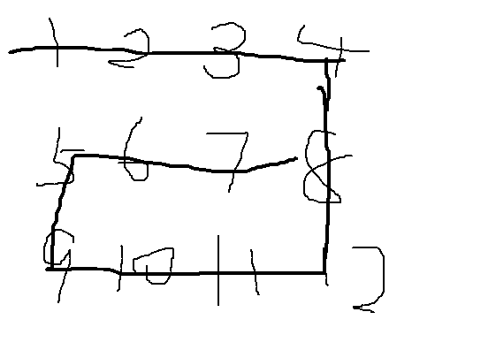

```java
package com.lcz.leetcode;

public class Code_PrintMatrix {
	
	public static void spiralOrderPrint(int[][] matrix) {
		int tR = 0;
		int tC = 0;
		int dR = matrix.length-1;
		int dC = matrix[0].length-1;
		while(tR<=dR&&tC<=dC) {
			printEdge(matrix,tR++,tC++,dR--,dC--);
		}
	}
	
	public static void printEdge(int[][]m,int tR,int tC,int dR,int dC) {
		if(tR==dR) {
			// 同行
			for(int i=tC;i<=dC;i++) {
				System.out.print(m[tR][i] + " ");
			}
		}else if(tC==dC) {
			// 同列
			for(int i=tR;i<=dR;i++) {
				System.out.print(m[i][tC] + " ");
			}
		}else {
			// 开始4次while
			int curR = tR;
			int curC = tC;
			while(curC!=dC) {
				System.out.print(m[tR][curC] + " ");
				curC++;
			}
			while(curR!=dR) {
				System.out.print(m[curR][dC] + " ");
				curR++;
			}
			
			while(curC!=tC) {
				System.out.print(m[dR][curC] + " ");
				curC--;
			}
			
			while(curR!=tR) {
				System.out.print(m[curR][tC] + " ");
				curR--;
			}
		}
	}
	
	// 主函数
	public static void main(String[] args) {
		int[][] matrix = {{1,2,3,4},{5,6,7,8},{9,10,11,12},{13,14,15,16}};
		spiralOrderPrint(matrix);
	}
}

```

## 题目六、旋转正方形矩阵

> 给定一个整型正方形矩阵matrix，请把该矩阵调整成顺时针旋转90度的样子。

```java
package com.lcz.leetcode;

public class Code_RotateMatrix {
	public static void rotate(int[][] matrix) {
		int tR = 0;
		int tC = 0;
		int dR = matrix.length-1;
		int dC = matrix[0].length-1;
		while(tR<dR) {
			rotateEdge(matrix,tR++,tC++,dR--,dC--);
		}
	}
	
	public static void rotateEdge(int[][] m,int tR,int tC,int dR,int dC) {
		int times = dC-tC;
		int tmp = 0;
		for(int i=0;i!=times;i++) {
			tmp = m[tR][tC + i];
			m[tR][tC + i] = m[dR - i][tC];
			m[dR - i][tC] = m[dR][dC - i];
			m[dR][dC - i] = m[tR + i][dC];
			m[tR + i][dC] = tmp;
			
		}
	}
	
	// 打印矩阵
	public static void printMatrix(int[][] matrix) {
		for(int i=0;i<matrix.length;i++) {
			for(int j=0;j<matrix[0].length;j++) {
				System.out.print(matrix[i][j] + " ");
			}
			System.out.println();
		}
	}
	public static void main(String[] args) {
		int[][] matrix = {{1,2,3,4},{5,6,7,8},{9,10,11,12},{13,14,15,16}};
		printMatrix(matrix);
		rotate(matrix);
		System.out.println("===========");
		printMatrix(matrix);
	}
}

```

## 题目七、“之”字形打印

> 给定一个矩阵matrix，按照“之”字形的 方式打印这个矩阵

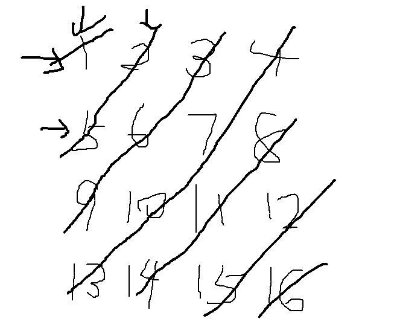

```java
package com.lcz.leetcode;

public class Code_ZigZagMatrix {
	public static void printMatrixZigZag(int[][] matrix) {
		int tR = 0;
		int tC = 0;
		int dR = 0;
		int dC = 0;
		int endR = matrix.length-1;
		int endC = matrix[0].length-1;
		boolean fromUp = false;
		while(tR!=endR+1) {
			printLevel(matrix,tR,tC,dR,dC,fromUp);
			tR = tC==endC?tR+1:tR;
			tC = tC==endC?tC:tC+1;
			dC = dR==endR?dC+1:dC;
			dR = dR==endR?dR:dR+1;
			fromUp = !fromUp;
		}
		System.out.println();
	}
	
	public static void printLevel(int[][] m,int tR,int tC,int dR,int dC,boolean f) {
		if(f) {
			while(tR!=dR+1) {
				System.out.print(m[tR++][tC--] + " ");
			}
		}else {
			while(dR!=tR-1) {
				System.out.print(m[dR--][dC++] + " ");
			}
		}
	}
	
	public static void main(String[] args) {
		int[][] matrix = {{1,2,3,4},{5,6,7,8},{9,10,11,12},{13,14,15,16}};
		printMatrixZigZag(matrix);
	}
}

```

## 题目八、反转单向和双向链表

```java
package com.lcz.leetcode;

public class Code_ReverseList {
	
	//单链表
	public static class Node{
		private int value;
		private Node next;
		public Node(int value) {
			this.value = value;
		}
	}
	
	// 翻转单向链表
	public static Node reverseList(Node head) {
		Node pre = null;
		Node next = null;
		while(head!=null) {
			next = head.next;
			head.next = pre;
			pre = head;
			head = next;
		}
		return pre;
	}
	
	// 双向链表
	public static class DoubleNode{
		private int value;
		private DoubleNode prev;
		private DoubleNode next;
		public DoubleNode(int value) {
			this.value = value;
		}
	}
	
	// 双向链表逆转
	private static DoubleNode reverseList(DoubleNode head) {
		DoubleNode pre = null;
		DoubleNode next = null;
		while(head!=null) {
			next = head.next;
			head.next = pre;
			head.prev = next;
			pre = head;
			head = next;
		}
		return pre;
	}
	
	// 打印单向链表
	public static void printLinkedList(Node head) {
		System.out.print("Linked List: ");
		while(head!=null) {
			System.out.print(head.value + " ");
			head = head.next;
		}
		System.out.println();
	}
	
	// 打印双向链表
	public static void printDoubleLinkedList(DoubleNode head) {
		System.out.print("Double Linked List: ");
		DoubleNode end = null;
		while (head != null) {
			System.out.print(head.value + " ");
			end = head;
			head = head.next;
		}
		System.out.print("| ");
		while (end != null) {
			System.out.print(end.value + " ");
			end = end.prev;
		}
		System.out.println();
	}
	
	// 主函数
	public static void main(String[] args) {
		Node head1 = new Node(1);
		head1.next = new Node(2);
		head1.next.next = new Node(3);
		printLinkedList(head1);
		head1 = reverseList(head1);
		printLinkedList(head1);
		
		
		DoubleNode head2 = new DoubleNode(1);
		head2.next = new DoubleNode(2);
		head2.next.prev = head2;
		head2.next.next = new DoubleNode(3);
		head2.next.next.prev = head2.next;
		head2.next.next.next = new DoubleNode(4);
		head2.next.next.next.prev = head2.next.next;
		printDoubleLinkedList(head2);
		printDoubleLinkedList(reverseList(head2));
	}
}

```

## 题目九、在行列都排好序的矩阵中找数

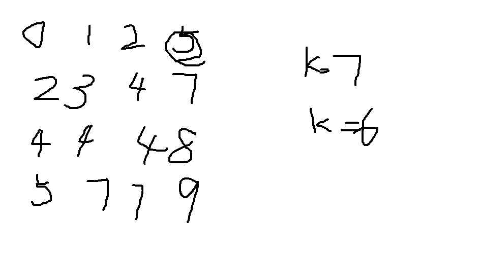

```java
package com.lcz.leetcode;

public class Code_FindNumInSortedMatrix {
	// 是否包含
	public static boolean isContains(int[][] matrix,int K) {
		int row = 0;
		int col = matrix[0].length-1;
		while(row<matrix.length&&col>-1) {
			if(matrix[row][col] == K) {
				return true;
			}else if(matrix[row][col]>K) {
				col--;
			}else {
				row++;
			}
		}
		return false;
	}
	
	public static void main(String[] args) {
		int[][] matrix = {{0,1,2,5},{2,3,4,7},{4,4,4,8},{5,7,7,9}};
		int K = 7;
		System.out.println(isContains(matrix, K));
	}
}

```


## 题目十、打印两个链表的公共部分

> 给定两个有序链表的头指针head1和head2，打印两个链表的公共部分。

```java
package com.lcz.leetcode;
/**
 * 打印两个链表公共部分
 * @author LvChaoZhang
 *
 */
public class Code_PrintComonPart {
	// 定义一个链表
	public static class Node{
		private int value;
		private Node next;
		public Node(int value) {
			this.value = value;
		}
	}
	
	// 打印公共部分
	public static void printCommonPart(Node head1,Node head2) {
		while(head1!=null&&head2!=null) {
			if(head1.value<head2.value) {
				head1 = head1.next;
			}else if(head1.value>head2.value) {
				head2 = head2.next;
			}else {
				System.out.print(head1.value + " ");
				head1 = head1.next;
				head2 = head2.next;
			}
		}
		System.out.println();
	}
	
	// 主函数
	public static void main(String[] args) {
		Node node1 = new Node(0);
		node1.next = new Node(3);
		node1.next.next = new Node(5);
		node1.next.next.next = new Node(6);
		
		Node node2 = new Node(1);
		node2.next = new Node(2);
		node2.next.next = new Node(5);
		node2.next.next.next = new Node(7);
		node2.next.next.next.next = new Node(8);
		
		printCommonPart(node1, node2);
	}
}

```

> 补充：合并两个链表

```java
public static Node compact(Node head1,Node head2) {
		Node newNode = new Node(-1);
		Node dummy = newNode;
		while(head1!=null&&head2!=null) {
			if(head1.value>head2.value) {
				newNode.next = head2;
				newNode = newNode.next;
				head2 = head2.next;
			}else {
				newNode.next = head1;
				newNode = newNode.next;
				head1 = head1.next;
			}
		}
		if(head1!=null) {
			newNode.next =  head1;
		}
		if(head2!=null) {
			newNode.next = head2;
		}
		return dummy.next;
	}
	
	// 打印链表
	public static void printLinkedList(Node node) {
		while(node!=null) {
			System.out.print(node.value + " ");
			node = node.next;
		}
		System.out.println();
	}
```

## 题目十一、判断一个链表是否为回文结构

> 给定一个链表的头结点head，请判断该链表是否为回文结构。例如:1->2->1,返回true。  1->2->2-1,返回true。 15->6->15，返回true， 1-2->3，返回false

用栈来解决该问题

```java
public class Code_IsPalindromeList {
	// 定义一个结点
	class Node{
		int val;
		Node next;
		public Node(int val) {
			this.val = val;
		}
	}
	
	public boolean IsPalindromeList(Node head) {
		Node node = head;
		// 用栈来存储
		Stack<Node> stack = new Stack<>();
		// 对其遍历
		while(head!=null) {
			stack.push(head);
			head = head.next;
		}
		// 对栈和重新遍历
		while(node!=null) {
			if(node.val!=stack.pop().val) {
				return false;
			}
			node = node.next;
		}
		return true;
	}
}

```

## 题目十二、将单向链表按某值划分成左边小、中间相等、右边大的形式

```java
public class Code_SmallerEqualBigger {
	// 结点
	class Node{
		int val;
		Node next;
		public Node(int val) {
			this.val = val;
		}
	}
	public static Node listPartition(Node head,int pivot) {
		Node sH = null; //small head
		Node sT = null; //small tail
		Node eH = null; //equal head
		Node eT = null; //equal tail
		Node bH = null; //big head
		Node bT = null; //big tail
		Node next = null;//next
		while(head!=null) {
			next = head.next;
			head.next=null;
			if(head.val<pivot) {
				if(sH==null) {
					sH = head;
					sT = head;
				}else {
					sT.next = head;
					sT = head;
				}
			}else if(head.val==pivot) {
				if(eH==null) {
					eH = head;
					eT = head;
				}else {
					eT.next = head;
					eT = head;
				}
			}else {
				if(bH==null) {
					bH = head;
					bT = head;
				}else {
					bT.next = head;
					bT = head;
				}
			}
			head = next;
		}
		if(sT!=null) {
			sT.next = eH;
			eT = eT == null?sT:eT;
		}
		if(eT!=null) {
			eT.next = bH;
		}
		return sH!=null?sH:eH!=null?eH:bH;
	}
}

```

## 题目十三、复制含有随机指针节点的链表

> 哈希表来解决该问题

```java
package com.lcz.leetcode;

import java.util.HashMap;

/**
 * 复制含有随机指针结点的链表
 * @author LvChaoZhang
 *
 */
public class Code_CopyListWithRandom {
	// 结点
	public static class Node{
		private int value;
		private Node next;
		private Node rand;
		public Node(int value) {
			this.value = value;
		}
	}
	// 复制
	public static Node copyListWithRand(Node head) {
		// 用hashmap来存储
		HashMap<Node, Node> hashMap = new HashMap<Node, Node>();
		Node cur = head;
		while(cur!=null) {
			hashMap.put(cur,new Node(cur.value));
			cur = cur.next;
		}
		cur = head;
		while(cur!=null) {
			hashMap.get(cur).next = hashMap.get(cur.next);
			hashMap.get(cur).rand = hashMap.get(cur.rand);
			cur = cur.next;
		}
		return hashMap.get(head);
	}
}

```

## 题目十四、两个单链表相交的一系列问题

> 本题中，单链表可能有环，也可能无环。给定两个单链表的头结点head1和head2，这两个链表可能相交，也可能不相交。请实现一个函数，如果这两个链表相交，请返回相交的第一个节点；如果不相交，返回null即可。

**判断是否有环**

```java
	// 结点
	class Node{
		int val;
		Node next;
		public Node(int val) {
			this.val = val;
		}
	}
	// 判断其是否有环，有环则返回环开始，无环返回空
	public static Node getLoopNode(Node head) {
		// 快慢指针来解决 该问题
		if(head==null||head.next==null) {
			return null;
		}
		Node low = head;
		Node fast = head;
		while(low!=fast) {
			if(low.next==null||fast.next.next==null) {
				return null;
			}
			low = low.next;
			fast = fast.next.next;
		}
		fast = head;
		while(low!=fast) {
			low = low.next;
			fast = fast.next;
		}
		return low;
	}
	// 判断其是否有环，有环则返回环开始，无环返回空
	public static Node getLoopNode_2(Node head) {
		// hashset来解决该问题
		HashSet<Node> hashSet = new HashSet<Node>();
		while(head!=null) {
			if(hashSet.contains(head)) {
				return head;
			}
			hashSet.add(head);
			head = head.next;
		}
		return null;
	}
```

**单链表若有环，必是下面的情形**

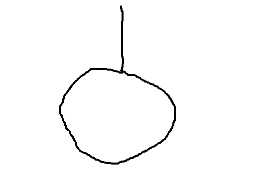

**单链表相交的几种情况：**

- 两个无环的单链表

  - 相交

  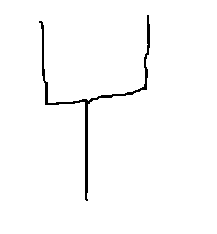

  - 不相交

  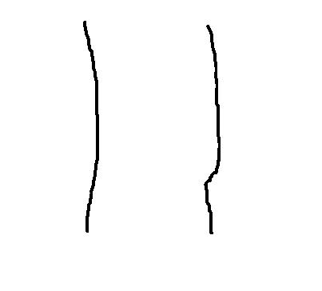

  ```java
  	//两个无环的链表判断是否相交
  	public static Node noLoop(Node head1,Node head2) {
  		if(head1==null||head2==null) {
  			return null;
  		}
  		// 用hashSet来解决
  		HashSet<Node> hashSet = new HashSet<Node>();
  		while(head1!=null) {
  			hashSet.add(head1);
  			head1 = head1.next;
  		}
  		while(head2!=null) {
  			if(hashSet.contains(head2)) {
  				return head2;
  			}
  			head2 = head2.next;
  		}
  		return null;
  	}
  	// 两个无环的链表判断是否相交2
  	public static Node noLoop_2(Node head1,Node head2) {
  		if(head1==null||head2==null) {
  			return null;
  		}
  		Node cur1 = head1;
  		Node cur2 = head2;
  		int n = 0;
  		while(cur1.next!=null) {
  			n++;
  			cur1 = cur1.next;
  		}
  		while(cur2.next!=null) {
  			n--;
  			cur2 = cur2.next;
  		}
  		if(cur1!=cur2) {
  			return null;
  		}
  		cur1 = n>0?head1:head2;
  		cur2 = cur1==head1?head2:head1;
  		n = Math.abs(n);
  		while(n!=0) {
  			n--;
  			cur1 = cur1.next;
  		}
  		while(cur1!=cur2) {
  			cur1 = cur1.next;
  			cur2 = cur2.next;
  		}
  		return cur1;
  	}
  ```

  

- 一个有环一个无环

  - 必不可能相交

- 两个有环的情况

  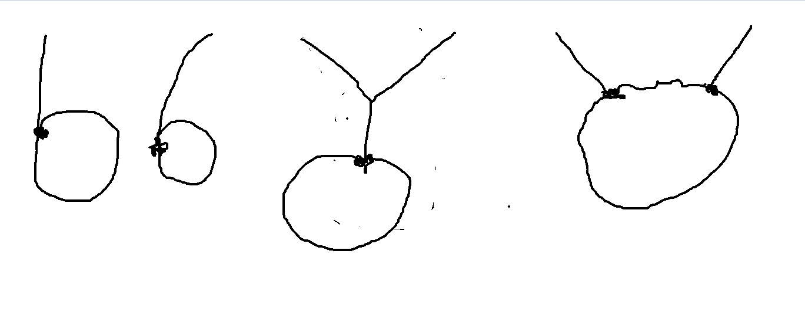

```java
	// 判断有环的两个链表 是否相交
	public static Node bothLoop(Node head1,Node loop1,Node head2,Node loop2) {
		Node cur1 = null;
		Node cur2 = null;
		if(loop1==loop2) {
			cur1 = head1;
			cur2 = head2;
			int n = 0;
			while(cur1!=loop1) {
				n++;
				cur1 = cur1.next;
			}
			while(cur2!=loop2) {
				n--;
				cur2 = cur2.next;
			}
			cur1 = n>0?head1:head2;
			cur2 = cur1==head1?head2:head1;
			n = Math.abs(n);
			while(n!=0) {
				n--;
				cur1 = cur1.next;
			}
			while(cur1!=cur2) {
				cur1 = cur1.next;
				cur2 = cur2.next;
			}
			return cur1;
		}else {
			cur1 = loop1.next;
			while(cur1!=loop1) {
				if(cur1==loop2) {
					return loop1;
				}
				cur1 = cur1.next;
			}
			return null;
		}
	}
	// 判断其是否有环，有环则返回环开始，无环返回空
	public static Node getLoopNode(Node head) {
		// 快慢指针来解决 该问题
		if(head==null||head.next==null) {
			return null;
		}
		Node low = head;
		Node fast = head;
		while(low!=fast) {
			if(low.next==null||fast.next.next==null) {
				return null;
			}
			low = low.next;
			fast = fast.next.next;
		}
		fast = head;
		while(low!=fast) {
			low = low.next;
			fast = fast.next;
		}
		return low;
	}
	// 判断其是否有环，有环则返回环开始，无环返回空
	public static Node getLoopNode_2(Node head) {
		// hashset来解决该问题
		HashSet<Node> hashSet = new HashSet<Node>();
		while(head!=null) {
			if(hashSet.contains(head)) {
				return head;
			}
			hashSet.add(head);
			head = head.next;
		}
		return null;
	}
```

# 树

## 题目一、二叉树的先序、中序、后序遍历

```java
package com.lcz.leetcode;
/**
 * 遍历
 * @author LvChaoZhang
 *
 */
import java.util.*;
public class Code_Traversal {
	// 结点
	public static class Node{
		private int value;
		private Node left;
		private Node right;
		public Node(int value) {
			this.value = value;
		}
	}
	
	// 前序遍历
	public static void preOrderRecur(Node head) {
		if(head==null) {
			return;
		}
		System.out.print(head.value + " ");
		preOrderRecur(head.left);
		preOrderRecur(head.right);
	}
	// 前序遍历非递归方法
	public static void preOrderNoRecur(Node head) {
		if(head!=null) {
			// 栈
			Stack<Node> stack = new Stack<Node>();
			stack.push(head);
			while(!stack.isEmpty()) {
				head = stack.pop();
				System.out.print(head.value + " ");
				
				if(head.right!=null) {
					stack.push(head.right);
				}
				
				if(head.left!=null) {
					stack.push(head.left);
				}
			}
		}
	}
	
	// 中序遍历
	public static void inorderRecur(Node head) {
		if(head==null) {
			return;
		}
		inorderRecur(head.left);
		System.out.print(head.value + " ");
		inorderRecur(head.right);
	}
	// 非递归形式
	public static void inorderNoRecur(Node head) {
		if(head!=null) {
			// 用栈
			Stack<Node> stack = new Stack<Node>();
			while(head!=null||!stack.isEmpty()) {
				if(head!=null) {
					stack.push(head);
					head = head.left;
				}else {
					head = stack.pop();
					System.out.print(head.value);
					head = head.right;
				}
			}
		}
		System.out.println();
	}
	
	// 后序遍历
	public static void postorderRecur(Node head) {
		if(head==null) {
			return ;
		}
		postorderRecur(head.left);
		postorderRecur(head.right);
		System.out.print(head.value + " ");
	}
	
	// 非递归形式
	public static void postOrderNoRecur(Node head) {
		if(head!=null) {
			// 两个栈
			Stack<Node> s1 = new Stack<Node>();
			Stack<Node> s2 = new Stack<Node>();
			s1.push(head);
			while(!s1.isEmpty()) {
				head = s1.pop();
				s2.push(head);
				
				if(head.left!=null) {
					s1.push(head.left);
				}
				
				if(head.right!=null) {
					s1.push(head.right);
				}
			}
			while(!s2.isEmpty()) {
				System.out.print(s2.pop().value +  " ");
			}
		}
	}
}

```


## 题目二、如何直观打印一棵二叉树

```java
package class_04;

public class Code_02_PrintBinaryTree {

	public static class Node {
		public int value;
		public Node left;
		public Node right;

		public Node(int data) {
			this.value = data;
		}
	}

	public static void printTree(Node head) {
		System.out.println("Binary Tree:");
		printInOrder(head, 0, "H", 17);
		System.out.println();
	}

	public static void printInOrder(Node head, int height, String to, int len) {
		if (head == null) {
			return;
		}
		printInOrder(head.right, height + 1, "v", len);
		String val = to + head.value + to;
		int lenM = val.length();
		int lenL = (len - lenM) / 2;
		int lenR = len - lenM - lenL;
		val = getSpace(lenL) + val + getSpace(lenR);
		System.out.println(getSpace(height * len) + val);
		printInOrder(head.left, height + 1, "^", len);
	}

	public static String getSpace(int num) {
		String space = " ";
		StringBuffer buf = new StringBuffer("");
		for (int i = 0; i < num; i++) {
			buf.append(space);
		}
		return buf.toString();
	}

	public static void main(String[] args) {
		Node head = new Node(1);
		head.left = new Node(-222222222);
		head.right = new Node(3);
		head.left.left = new Node(Integer.MIN_VALUE);
		head.right.left = new Node(55555555);
		head.right.right = new Node(66);
		head.left.left.right = new Node(777);
		printTree(head);

		head = new Node(1);
		head.left = new Node(2);
		head.right = new Node(3);
		head.left.left = new Node(4);
		head.right.left = new Node(5);
		head.right.right = new Node(6);
		head.left.left.right = new Node(7);
		printTree(head);

		head = new Node(1);
		head.left = new Node(1);
		head.right = new Node(1);
		head.left.left = new Node(1);
		head.right.left = new Node(1);
		head.right.right = new Node(1);
		head.left.left.right = new Node(1);
		printTree(head);

	}

}

```


## 题目三、二叉树中找寻一个节点的后继节点

> 解题思路：以中序遍历为例：左 中 右  其为在右子树找最左

```java
public class SuccessorNode {
	public static class Node{
		private int value;
		private Node left;
		private Node right;
		private Node parent;
		
		public Node(int value) {
			this.value = value;
		}
	}
	
	// 找后继结点
	public static Node successorNode(Node node) {
		if(node==null) {
			return null;
		}
		// 后继结点如果在右子树
		Node p = node.right;
		if(p!=null) {
			while(p.left!=null) {
				p = p.left;
			}
			return p;
		}
		
		// 后继结点在父节点上
		while(node.parent!=null&&node.parent.right==node) {
			node = node.parent;
		}
		return node.parent;
	}
}
```


## 题目四、二叉树的序列化和反序列化

```java
package class_04;

import java.util.LinkedList;
import java.util.Queue;

public class Code_04_SerializeAndReconstructTree {

	public static class Node {
		public int value;
		public Node left;
		public Node right;

		public Node(int data) {
			this.value = data;
		}
	}

	public static String serialByPre(Node head) {
		if (head == null) {
			return "#!";
		}
		String res = head.value + "!";
		res += serialByPre(head.left);
		res += serialByPre(head.right);
		return res;
	}

	public static Node reconByPreString(String preStr) {
		String[] values = preStr.split("!");
		Queue<String> queue = new LinkedList<String>();
		for (int i = 0; i != values.length; i++) {
			queue.offer(values[i]);
		}
		return reconPreOrder(queue);
	}

	public static Node reconPreOrder(Queue<String> queue) {
		String value = queue.poll();
		if (value.equals("#")) {
			return null;
		}
		Node head = new Node(Integer.valueOf(value));
		head.left = reconPreOrder(queue);
		head.right = reconPreOrder(queue);
		return head;
	}

	public static String serialByLevel(Node head) {
		if (head == null) {
			return "#!";
		}
		String res = head.value + "!";
		Queue<Node> queue = new LinkedList<Node>();
		queue.offer(head);
		while (!queue.isEmpty()) {
			head = queue.poll();
			if (head.left != null) {
				res += head.left.value + "!";
				queue.offer(head.left);
			} else {
				res += "#!";
			}
			if (head.right != null) {
				res += head.right.value + "!";
				queue.offer(head.right);
			} else {
				res += "#!";
			}
		}
		return res;
	}

	public static Node reconByLevelString(String levelStr) {
		String[] values = levelStr.split("!");
		int index = 0;
		Node head = generateNodeByString(values[index++]);
		Queue<Node> queue = new LinkedList<Node>();
		if (head != null) {
			queue.offer(head);
		}
		Node node = null;
		while (!queue.isEmpty()) {
			node = queue.poll();
			node.left = generateNodeByString(values[index++]);
			node.right = generateNodeByString(values[index++]);
			if (node.left != null) {
				queue.offer(node.left);
			}
			if (node.right != null) {
				queue.offer(node.right);
			}
		}
		return head;
	}

	public static Node generateNodeByString(String val) {
		if (val.equals("#")) {
			return null;
		}
		return new Node(Integer.valueOf(val));
	}

	// for test -- print tree
	public static void printTree(Node head) {
		System.out.println("Binary Tree:");
		printInOrder(head, 0, "H", 17);
		System.out.println();
	}

	public static void printInOrder(Node head, int height, String to, int len) {
		if (head == null) {
			return;
		}
		printInOrder(head.right, height + 1, "v", len);
		String val = to + head.value + to;
		int lenM = val.length();
		int lenL = (len - lenM) / 2;
		int lenR = len - lenM - lenL;
		val = getSpace(lenL) + val + getSpace(lenR);
		System.out.println(getSpace(height * len) + val);
		printInOrder(head.left, height + 1, "^", len);
	}

	public static String getSpace(int num) {
		String space = " ";
		StringBuffer buf = new StringBuffer("");
		for (int i = 0; i < num; i++) {
			buf.append(space);
		}
		return buf.toString();
	}

	public static void main(String[] args) {
		Node head = null;
		printTree(head);

		String pre = serialByPre(head);
		System.out.println("serialize tree by pre-order: " + pre);
		head = reconByPreString(pre);
		System.out.print("reconstruct tree by pre-order, ");
		printTree(head);

		String level = serialByLevel(head);
		System.out.println("serialize tree by level: " + level);
		head = reconByLevelString(level);
		System.out.print("reconstruct tree by level, ");
		printTree(head);

		System.out.println("====================================");

		head = new Node(1);
		printTree(head);

		pre = serialByPre(head);
		System.out.println("serialize tree by pre-order: " + pre);
		head = reconByPreString(pre);
		System.out.print("reconstruct tree by pre-order, ");
		printTree(head);

		level = serialByLevel(head);
		System.out.println("serialize tree by level: " + level);
		head = reconByLevelString(level);
		System.out.print("reconstruct tree by level, ");
		printTree(head);

		System.out.println("====================================");

		head = new Node(1);
		head.left = new Node(2);
		head.right = new Node(3);
		head.left.left = new Node(4);
		head.right.right = new Node(5);
		printTree(head);

		pre = serialByPre(head);
		System.out.println("serialize tree by pre-order: " + pre);
		head = reconByPreString(pre);
		System.out.print("reconstruct tree by pre-order, ");
		printTree(head);

		level = serialByLevel(head);
		System.out.println("serialize tree by level: " + level);
		head = reconByLevelString(level);
		System.out.print("reconstruct tree by level, ");
		printTree(head);

		System.out.println("====================================");

		head = new Node(100);
		head.left = new Node(21);
		head.left.left = new Node(37);
		head.right = new Node(-42);
		head.right.left = new Node(0);
		head.right.right = new Node(666);
		printTree(head);

		pre = serialByPre(head);
		System.out.println("serialize tree by pre-order: " + pre);
		head = reconByPreString(pre);
		System.out.print("reconstruct tree by pre-order, ");
		printTree(head);

		level = serialByLevel(head);
		System.out.println("serialize tree by level: " + level);
		head = reconByLevelString(level);
		System.out.print("reconstruct tree by level, ");
		printTree(head);

		System.out.println("====================================");

	}
}

```


## 题目五、折纸问题

> 【题目】 请把一段纸条竖着放在桌子上，然后从纸条的下边向 上方对折1次，压出折痕后展开。此时 折痕是凹下去的，即折痕 突起的方向指向纸条的背面。如果从纸条的下边向上方连续对折 2 次，压出折痕后展开，此时有三条折痕，从上到下依次是下折 痕、下折痕和上折痕。 给定一 个输入参数N，代表纸条都从下边向上方连续对折N次， 请从上到下打印所有折痕的方向。 例如：N=1时，打印： down N=2时，打印： down down up

```java
	public static void printAllFolds(int N) {
		printProcess(1,N,true);
	}
	
	public static void printProcess(int i,int N,boolean down) {
		// 递归结束条件
		if(i>N) {
			return;
		}
		printProcess(i+1,N,true);
		System.out.print(down?"down ":"up ");
		printProcess(i+1, N, false);
	}
	
	// 主函数
	public static void main(String[] args) {
		int N = 2;
		printAllFolds(N);
	}
```


## 题目六、判断一棵二叉树是否是平衡二叉树

> 平衡二叉树：一个节点的左右节点高度差不超过1. 判断平衡，判断高度。

```java
package com.lcz.leetcode;
/**
 * 判断一棵树是否是平衡二叉树
 * @author LvChaoZhang
 *
 */
public class Code_IsBalanceTree {
	// 结点
	public static class Node{
		private int val;
		private Node left;
		private Node right;
		public Node(int val) {
			this.val = val;
		}
	}
	// 封装一个返回值
	public static class ReturnData{
		public boolean isB;
		public int h;
		public ReturnData(boolean isB,int h) {
			this.isB = isB;
			this.h = h;
		}
	}
	
	public static boolean isB(Node head) {
		
	}
	
	public static ReturnData process(Node head) {
		if(head==null) {
			return new ReturnData(true, 0);
		}
		
		ReturnData leftData = process(head.left);
		if(!leftData.isB) {
			return new ReturnData(false, 0);
		}
		
		ReturnData rightData = process(head.right);
		if(!rightData.isB) {
			return new ReturnData(false, 0);
		}
		
		if(Math.abs(leftData.h-rightData.h)>1) {
			return new ReturnData(false, 0);
		}
		
		return new ReturnData(true, Math.max(leftData.h, rightData.h)+1);
	}
}

```


## 题目七、判断一棵树是否是搜索二叉树、判断一棵树是否是完全二叉树

> 搜索二叉树就是中序遍历，按照顺序。

```java
// 结点
	public static class Node{
		private int val;
		private Node left;
		private Node right;
		public Node(int val) {
			this.val = val;
		}
	}
	
	// 判断其是否为二叉搜索树
	public static boolean isBST(Node head) {
		if(head==null) {
			return true;
		}
		// 对其进行中序遍历
		long pre = Long.MIN_VALUE;
		if(head!=null) {
			//栈
			Stack<Node> stack = new Stack<Node>();
			while(head!=null||!stack.isEmpty()) {
				if(head!=null) {
					stack.push(head);
					head = head.left;
				}else {
					head = stack.pop();
					// 处理数据
					if(pre!=Long.Min_VALUE&&head.val<=pre) {
						return false;
					}
					pre = head.val;
					head = head.right;
				}
			}
		}
		
		return true;
	}
```

> 完全二叉树，层次遍历，到右节点空的时机之后，就要求之后都是叶子了

```java
	/**
	 * 判断其一棵树是否为完全二叉树
	 */
	public static boolean isComplete(Node head) {
		if(head==null) {
			return true;
		}
		// 对其进行层次遍历
		Queue<Node> queue = new LinkedList<>();
		queue.offer(head);
		boolean leaf = false;
		while(!queue.isEmpty()) {
			head = queue.poll();
			// 启用
			if(leaf) {
				if(!(head.left==null && head.right==null)) {
					return false;
				}
			}
			
			if(head.left!=null) {
				queue.offer(head.left);
			}else if(head.right!=null) {
				return false;
			}
			
			if(head.right!=null) {
				queue.offer(head.right);
			}else {
				leaf = true;
			}
		}
		
		return true;
	}
}

```


题目八、已知一棵完全二叉树，求其节点的个数

```java
public class Code_08_CompleteTreeNodeNumber {

	public static class Node {
		public int value;
		public Node left;
		public Node right;

		public Node(int data) {
			this.value = data;
		}
	}

	public static int nodeNum(Node head) {
		if (head == null) {
			return 0;
		}
		return bs(head, 1, mostLeftLevel(head, 1));
	}

	public static int bs(Node node, int l, int h) {
		if (l == h) {
			return 1;
		}
		if (mostLeftLevel(node.right, l + 1) == h) {
			return (1 << (h - l)) + bs(node.right, l + 1, h);
		} else {
			return (1 << (h - l - 1)) + bs(node.left, l + 1, h);
		}
	}

	public static int mostLeftLevel(Node node, int level) {
		while (node != null) {
			level++;
			node = node.left;
		}
		return level - 1;
	}

	public static void main(String[] args) {
		Node head = new Node(1);
		head.left = new Node(2);
		head.right = new Node(3);
		head.left.left = new Node(4);
		head.left.right = new Node(5);
		head.right.left = new Node(6);
		System.out.println(nodeNum(head));

	}

}
```


# 哈希

## 题目一、认识哈希函数和哈希表

**哈希函数特点：**

- 1.输入域无穷，输出域有限。例如，有无穷多个输入参数经过hash函数映射后可以得到有限的输出与{1,2,3,4}
- 2.输入参数确定，经过hash函数映射出的返回值可能一样
- 3.输入域上的值经过函数值映射几乎会均等的分布在输出域中，

**哈希表**

hashmap里面的结构原理是什么，key通过hash函数得到一个hashcode，然后决定放入到数组的那个位置里面，map中的key,value是以Entry的形式存在数组里面的，同一个hashcode的值会存入同一个位置里面，在jdk1.7里面是使用链表的方式将同一个hashcode的值相互连接。jdk1.8里面是使用数组+链表+红黑树


## 题目二、设计RandomPool结构

> 设计一种结构，在该结构中有如下三个功能：insert(key):将某个key加入到该结构，做到不重复添加。delete(key):将原本在结构中的某个key移除。getRandom()等概率随机返回结构中的任何一个key。
>
> 要求：insert、delete和getrandom方法的时间复杂度都是O（1）。

思想：这道题，我们可以使用两个hashmap来完成，一个用来存放（key,size),一个用来存放（size，key)。insert方法，如果不包含key，则两个hashmap都存放进去；delete方法，首先，我们通过（key,size)这个hashmap查看是否存在，然后因为删除了那么这个map里面肯定是有一个空洞的，所有我们可以先把要删除的那个Key放到最后的一个位置，然后再删除它，size–。
为什么要用两个map呢，思考一下，因为当我们删除的时候我们不仅仅要得到要删除的那个key，我们还要知道最后的那个key，这样我们才能把最后的那个key放到删除的那个位置去。 一个hashmap更新 一个替换。

```java
	// 成员变量
	private HashMap<K,Integer> keyIndexMap;
	private HashMap<Integer,K> indexKeyMap;
	private int size;
	
	//初始化
	public RandomPool() {
		keyIndexMap = new HashMap<K, Integer>();
		indexKeyMap = new HashMap<Integer, K>();
		size = 0;
	}
	
	// 插入
	public void insert(K key) {
		// 三个变量同时变化
		keyIndexMap.put(key,size);
		indexKeyMap.put(size,key);
		size++;
	}
	// 删除
	public void delete(K key) {
		if(this.keyIndexMap.containsKey(key)) {
			// 找到该索引
			int deleteIndex = this.keyIndexMap.get(key);
			// 在另外一个集合
			int lastIndex = --this.size;
			K lastKey = this.indexKeyMap.get(lastIndex);
			// 替换
			this.keyIndexMap.put(lastKey,deleteIndex);
			this.indexKeyMap.put(deleteIndex,lastKey);
			// 删除
			this.keyIndexMap.remove(key);
			this.indexKeyMap.remove(lastIndex);
		}
	}
	
	// 随机获取值
	public K getRandom() {
		if(this.size==0) {
			return null;
		}
		int randomIndex = (int)(Math.random()*this.size); // 0~size-1
		return this.indexKeyMap.get(randomIndex);
	}		
	
}
```


## 题目三、认识布隆过滤器

> 通过一个案例来认识布隆过滤器

**题目：**

不安全的网页黑名单包含100亿个黑名单网页，每个网页最多占用64B。现在想要实现一个网页过滤器系统，可根据URL判断该网页是否在黑名单上。

**要求：**

- 1.该系统允许有一定的判断失误率
- 2.使用的额外空间不超过30GB

**分析**

- 如果把所有的URL通过数据库或者哈希函数保存起来,一个是64B,100亿个就是640GB,就不能满足额外空间不超过30GB这个条件了.
- 对于网页黑名单系统,垃圾邮件过滤系统,爬虫的网址判重系统,又容忍一定的失误率.这个时候我们就需要用到布隆过滤器.


>布隆过滤器精准的代表了一个集合,又可以精确的判断一个元素是否在集合之中.完全正确是不可能的,布隆过滤器的特点就是通过很少的空间就找到准确度很高的程度.在使用布隆过滤器之前,我们要先了解哈希函数(散列函数).它的输入域可以是很大的范围,但他的输出域就是固定的范围

**哈希函数**

- 典型的哈希函数都有无限的输入值域

- 当给哈希函数传入相同的值的时候,返回值是一样的

- 当传入不同的值,输出值可能一样,也可能不一样.**这个是肯定的,毕竟输出值的域统一是S,所以不同的输入值可能会对应同一个输出值**

**布隆过滤器**

假如现在有一个长度为m的bit类型的数组。

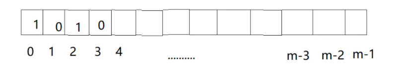

这个这是个bit类型的数组,比特类型的,所有其中的值就是0,或者是1.然后我们假设有k个hash函数,经过这些函数的输出域都是大于等于m的,然后这些哈希函数都足够优秀,并且这些彼此独立.对于同一个输入对象,经过k个哈希函数算出来的结果也是独立的,可能相同,也可能不同,彼此独立,然后对每一个结果都取模m,然后把bit array上相应的位置置为1(涂黑).

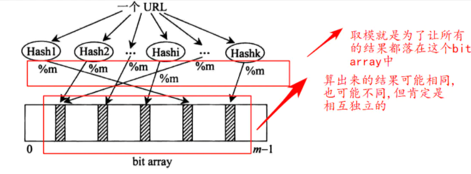

,这样的话一个输入对象(一个url)就把自己放入了这个bit array中了,然后就按照这个方法处理所有的输入对象(30亿个URL).......
 最后处理完了所有的输入对象,这个时候bitMap就已经有相当多的位置被涂黑.
 **这样一个布隆过滤器就生成完毕了**


**如何通过布隆过滤器检查URL**

假设现在有一个a对象,想要检查它是否是之前的输入对象.

- 1.把a通过k个哈希函数算出k个值,然后把这k个值都去余,使得0----m-1上有这个k个值,然后重头戏来了
- **2.这个时候看看每个值对应在bit array是否是涂黑的,即是否为1,如果全部为1,说明就在这个名单之中,如果有一个是白的,则说明不在其中**
   **说的在具体一点,a如果是输入对象,那么它对应的k个值在bit array中一定会涂黑,a一定不会漏盘**
   **a如果是之前输入的,那么它一定可以被找到**
- **3.然后就是漏判的情况,如果它不是之前的输入对象,但它经过k个哈希函数,对应的位置都有可能是黑的**


**布隆过滤器的几个评价标准？**

- 布隆过滤器的大小
- 哈希函数的个数
- 失误率

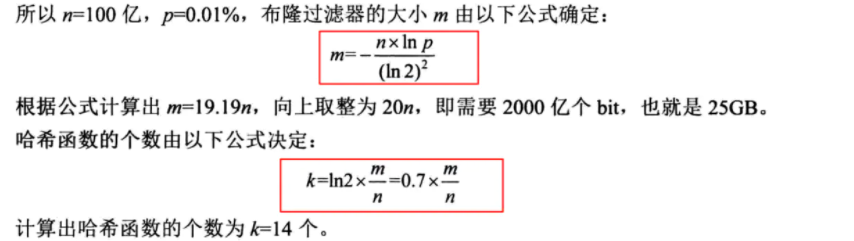

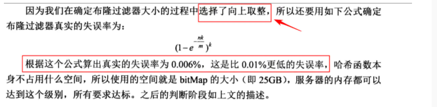

## 题目四、认识一致性哈希

参考https://codingchaozhang.blog.csdn.net/article/details/109737335

## 题目五、认识并查集

> 并查集是一种数据结构，常用于描述集合，经常用与解决此类问题：
>
> - 某个元素是否属于某个集合
> - 某个元素和另外一个元素是否同属于一个集合

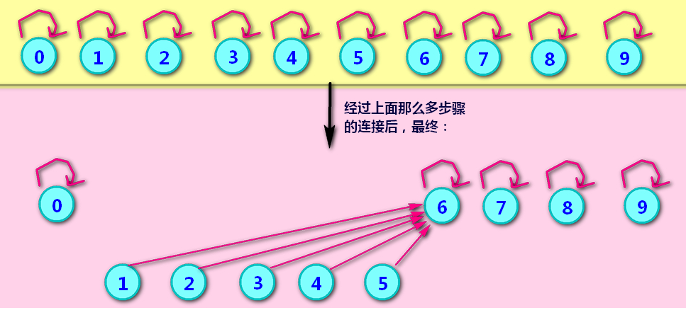

```java
// 要建立的结点
	public static class Node{
		
	}
	
	public static class UnionFindSet{
		public HashMap<Node,Node> fatherMap;
		public HashMap<Node,Integer> sizeMap;
		// 初始化这两个hashmap
		public void makeSets(List<Node> nodes) {
			for(Node node:nodes) {
				fatherMap.put(node,node);
				sizeMap.put(node, 1);
			}
		}
		//查找是否属与同一个集合
		private Node findHead(Node node) {
			Node father = fatherMap.get(node);
			if(father!=node) {
				father = findHead(father);
			}
			// 查找该父节点之后，将结点之间跟父节点连接
			fatherMap.put(node, father);
			return father;
		}
		public boolean isSameSet(Node a,Node b) {
			return findHead(a) == findHead(b);
		}
		// 合并两个元素
		public void union(Node a,Node b) {
			if(a==null||b==null) {
				return;
			}
			
			
			Node aHead = findHead(a);
			Node bHead = findHead(b);
			if(aHead!=bHead) {
				int aSize = sizeMap.get(aHead);
				int bSize = sizeMap.get(bHead);
				if(aSize<=bSize) {
					fatherMap.put(aHead,bHead);
					sizeMap.put(bHead, aSize+bSize);
				}else {
					fatherMap.put(bHead, aHead);
					sizeMap.put(aHead, aSize+bSize);
				}
			}
		}
		
	}
```


并查集的思想就是，同一个连通区域内的所有点的根节点是同一个。将每个点映射成一个数字。先假设每个点的根节点就是他们自己，然后我们以此输入连通的点对，然后将其中一个点的根节点赋成另一个节点的根节点，这样这两个点所在连通区域又相互连通了。
并查集的主要操作有：

- find(int m)：这是并查集的基本操作，查找 mm 的根节点。

- isConnected(int m,int n)：判断 m，nm，n 两个点是否在一个连通区域。

- union(int m,int n):合并 m，nm，n 两个点所在的连通区域。

```java
class UnionFind {
    int[] parents;

    public UnionFind(int totalNodes) {
        parents = new int[totalNodes];
        for (int i = 0; i < totalNodes; i++) {
            parents[i] = i;
        }
    }
		// 合并连通区域是通过find来操作的, 即看这两个节点是不是在一个连通区域内.
    void union(int node1, int node2) {
        int root1 = find(node1);
        int root2 = find(node2);
        if (root1 != root2) {
            parents[root2] = root1;
        }
    }

    int find(int node) {
        while (parents[node] != node) {
            // 当前节点的父节点 指向父节点的父节点.
            // 保证一个连通区域最终的parents只有一个.
            parents[node] = parents[parents[node]];
            node = parents[node];
        }

        return node;
    }

    boolean isConnected(int node1, int node2) {
        return find(node1) == find(node2);
    }
}


```


```java
 private class UnionFind {
        /**
         * 连通分量的个数
         */
        private int count;
        private int[] parent;

        public int getCount() {
            return count;
        }

        public UnionFind(int n) {
            this.count = n;
            parent = new int[n];
            for (int i = 0; i < n; i++) {
                parent[i] = i;
            }
        }

        private int find(int x) {
            while (x != parent[x]) {
                parent[x] = parent[parent[x]];
                x = parent[x];
            }
            return x;
        }

        public void union(int x, int y) {
            int xRoot = find(x);
            int yRoot = find(y);
            if (xRoot == yRoot) {
                return;
            }

            parent[xRoot] = yRoot;
            count--;
        }
    }

```


## 题目六、岛问题


> 一个矩阵中只有0和1两种值，每个位置都可以和自己的上、下、左、右 四个位置相连，如果有一片1连在一起，这个部分叫做一个岛，求一个 矩阵中有多少个岛？ 

> 举例： 

 0 0 1 0 1 0

 1 1 1 0 1 0

 1 0 0 1 0 0

 0 0 0 0 0 0 

> 这个矩阵中有三个岛。

```java
public static int countIslands(int[][] m) {
		if (m == null || m[0] == null) {
			return 0;
		}
		int N = m.length;
		int M = m[0].length;
		int res = 0;
		for (int i = 0; i < N; i++) {
			for (int j = 0; j < M; j++) {
				if (m[i][j] == 1) {
					res++;
					infect(m, i, j, N, M);
				}
			}
		}
		return res;
	}

	public static void infect(int[][] m, int i, int j, int N, int M) {
		if (i < 0 || i >= N || j < 0 || j >= M || m[i][j] != 1) {
			return;
		}
		m[i][j] = 2;
		infect(m, i + 1, j, N, M);
		infect(m, i - 1, j, N, M);
		infect(m, i, j + 1, N, M);
		infect(m, i, j - 1, N, M);
	}

```


并查集的解法

```java
package com.lcz.leetcode;

public class Leetcode200_2 {
	
	private int rows;
	private int cols;
	
	// 声明一个并查集类
	private class UnionFind{
		private int count;
		private int[] parent;
		
		public UnionFind(int n) {
			this.count = n;
			parent = new int[n];
			for(int i=0;i<n;i++) {
				parent[i] = i;
			}
		}
		public int getCount() {
			return this.count;
		}
		
		// 查找
		public int find(int x) {
			while(x!=parent[x]) {
				parent[x] = parent[parent[x]];
				x = parent[x];
			}
			return x;
		}
		// 判断是否在同一点上
		public boolean isConnected(int x1,int x2) {
			return find(x1)==find(x2);
		}
		// 合并
		public void union(int x,int y) {
			int xRoot = find(x);
			int yRoot = find(y);
			if(xRoot==yRoot) {
				return;
			}
			
			parent[xRoot] = yRoot;
			count--;
		}
	}
	
	
	//二维转一维的
	private int node(int i,int j) {
		return i*cols+j;
	}
	
	// 判断
	public int numIslands(char[][] grid) {
		rows = grid.length;
		if(rows==0) {
			return 0;
		}
		cols = grid[0].length;
		
		//空地的数量
		int spaces = 0;
		
		UnionFind unionfind = new UnionFind(rows*cols);
		for(int i=0;i<rows;i++) {
			for(int j=0;j<cols;j++) {
				if(grid[i][j]=='0') {
					spaces++;
				}else {
					// 和上下左右合并成一个连通区域
					if(i>0&&grid[i-1][j]=='1') {
						unionfind.union(node(i,j), node(i-1,j));
					}
					
					if(i<rows-1&&grid[i+1][j]=='1') {
						unionfind.union(node(i,j), node(i+1,j));
					}
					
					if(j>0&&grid[i][j-1]=='1') {
						unionfind.union(node(i,j), node(i,j-1));
					}
					
					if(j<cols-1&&grid[i][j+1]=='1') {
						unionfind.union(node(i,j), node(i,j+1));
					}
				}
			}
		}
		
		return unionfind.getCount()-spaces;
	}
	
}

```


**类似题目：被围绕的区域**

>给定一个二维的矩阵，包含 `'X'` 和 `'O'`（**字母 O**）。
>
>找到所有被 `'X'` 围绕的区域，并将这些区域里所有的 `'O'` 用 `'X'` 填充。

> 示例:

X X X X
X O O X
X X O X
X O X X

> 运行你的函数后，矩阵变为：

X X X X
X X X X
X X X X
X O X X

> 解释:
>
> 被围绕的区间不会存在于边界上，换句话说，任何边界上的 'O' 都不会被填充为 'X'。 任何不在边界上，或不与边界上的 'O' 相连的 'O' 最终都会被填充为 'X'。如果两个元素在水平或垂直方向相邻，则称它们是“相连”的。

```java
class Solution {
    public void solve(char[][] board) {
        if (board == null || board.length == 0) return;
        int m = board.length;
        int n = board[0].length;
        for (int i = 0; i < m; i++) {
            for (int j = 0; j < n; j++) {
                // 从边缘o开始搜索
                boolean isEdge = i == 0 || j == 0 || i == m - 1 || j == n - 1;
                if (isEdge && board[i][j] == 'O') {
                    dfs(board, i, j);
                }
            }
        }

        for (int i = 0; i < m; i++) {
            for (int j = 0; j < n; j++) {
                if (board[i][j] == 'O') {
                    board[i][j] = 'X';
                }
                if (board[i][j] == '#') {
                    board[i][j] = 'O';
                }
            }
        }
    }

    public void dfs(char[][] board, int i, int j) {
        if (i < 0 || j < 0 || i >= board.length  || j >= board[0].length || board[i][j] == 'X' || board[i][j] == '#') {
            // board[i][j] == '#' 说明已经搜索过了. 
            return;
        }
        board[i][j] = '#';
        dfs(board, i - 1, j); // 上
        dfs(board, i + 1, j); // 下
        dfs(board, i, j - 1); // 左
        dfs(board, i, j + 1); // 右
    }
}
```

**并查集解法来解题**

```java
class Solution {
    private int rows;
    private int cols;

    class UnionFind {
        int[] parents;

        public UnionFind(int totalNodes) {
            parents = new int[totalNodes];
            for (int i = 0; i < totalNodes; i++) {
                parents[i] = i;
            }
        }
            // 合并连通区域是通过find来操作的, 即看这两个节点是不是在一个连通区域内.
        void union(int node1, int node2) {
            int root1 = find(node1);
            int root2 = find(node2);
            if (root1 != root2) {
                parents[root2] = root1;
            }
        }

        int find(int node) {
            while (parents[node] != node) {
                // 当前节点的父节点 指向父节点的父节点.
                // 保证一个连通区域最终的parents只有一个.
                parents[node] = parents[parents[node]];
                node = parents[node];
            }

            return node;
        }

        boolean isConnected(int node1, int node2) {
            return find(node1) == find(node2);
        }
    }

    int node(int i, int j) {
        return i * cols + j;
    }


    public void solve(char[][] board) {
        if (board == null || board.length == 0)
            return;

        rows = board.length;
        cols = board[0].length;

        // 用一个虚拟节点, 边界上的O 的父节点都是这个虚拟节点
        UnionFind uf = new UnionFind(rows * cols + 1);
        int dummyNode = rows * cols;

        for (int i = 0; i < rows; i++) {
            for (int j = 0; j < cols; j++) {
                if (board[i][j] == 'O') {
                    // 遇到O进行并查集操作合并
                    if (i == 0 || i == rows - 1 || j == 0 || j == cols - 1) {
                        // 边界上的O,把它和dummyNode 合并成一个连通区域.
                        uf.union(node(i, j), dummyNode);
                    } else {
                        // 和上下左右合并成一个连通区域.
                        if (i > 0 && board[i - 1][j] == 'O')
                            uf.union(node(i, j), node(i - 1, j));
                        if (i < rows - 1 && board[i + 1][j] == 'O')
                            uf.union(node(i, j), node(i + 1, j));
                        if (j > 0 && board[i][j - 1] == 'O')
                            uf.union(node(i, j), node(i, j - 1));
                        if (j < cols - 1 && board[i][j + 1] == 'O')
                            uf.union(node(i, j), node(i, j + 1));
                    }
                }
            }
        }

        for (int i = 0; i < rows; i++) {
            for (int j = 0; j < cols; j++) {
                if (uf.isConnected(node(i, j), dummyNode)) {
                    // 和dummyNode 在一个连通区域的,那么就是O；
                    board[i][j] = 'O';
                } else {
                    board[i][j] = 'X';
                }
            }
        }
    }
}
```

**字节跳动-朋友圈**

班上有 N 名学生。其中有些人是朋友，有些则不是。他们的友谊具有是传递性。如果已知 A 是 B 的朋友，B 是 C 的朋友，那么我们可以认为 A 也是 C 的朋友。所谓的朋友圈，是指所有朋友的集合。 给定一个 N * N 的矩阵 M，表示班级中学生之间的朋友关系。如果M[i][j] = 1，表示已知第 i 个和 j 个学生互为朋友关系，否则为不知道。你必须输出所有学生中的已知的朋友圈总数。 示例 1: 输入: [[1,1,0], [1,1,0], [0,0,1]] 输出: 2 说明：已知学生0和学生1互为朋友，他们在一个朋友圈。 第2个学生自己在一个朋友圈。所以返回2

类似岛问题。


# 七课

## 题目一、什么是前缀树

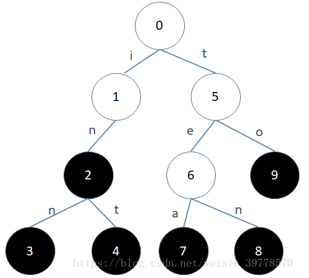

```java

/**
 * 前缀树
 * @author LvChaoZhang
 *
 */
public class Code_TrieTree {
	// 结点
	public static class TrieNode{
		public int path;
		public int end;
		public TrieNode[] nexts;
		
		public TrieNode() {
			path = 0;
			end = 0;
			nexts = new TrieNode[26];
		}
	}
	
	public static class Trie{
		private TrieNode root;
		
		public Trie() {
			root =  new TrieNode();
		}
		// 插入结点
		public void insert(String word) {
			if(word==null) {
				return;
			}
			char[] chs = word.toCharArray();
			TrieNode node  = root;
			int index = 0;
			for(int i=0;i<chs.length;i++) {
				index = chs[i] - 'a';
				if(node.nexts[index]==null) {
					node.nexts[index] = new TrieNode();
				}
				node = node.nexts[index];
				node.path++;
			}
			node.end++;
		}
		
		// 删除节点
		public void  delete(String word) {
			if(search(word)!=0) {
				char[] chs = word.toCharArray();
				TrieNode node = root;
				int index = 0;
				for(int i=0;i<chs.length;i++) {
					index = chs[i] - 'a';
					if(--node.nexts[index].path==0) {
						node.nexts[index] = null;
						return;
					}
					node = node.nexts[index];
				}
				node.end--;
			}
		}
		
		// 搜索一个单词
		public int search(String word) {
			if(word==null) {
				return 0;
			}
			char[] chs = word.toCharArray();
			TrieNode node = root;
			int index = 0;
			for(int i=0;i<chs.length;i++) {
				index = chs[i] - 'a';
				if(node.nexts[index]==null) {
					return 0;
				}
				node = node.nexts[index];
			}
			return node.end;
		}
		
		// 前缀
		public int prefixNumber(String pre) {
			if(pre==null) {
				return 0;
			}
			char[] chs = pre.toCharArray();
			TrieNode node = root;
			int index = 0;
			for(int i=0;i<chs.length;i++) {
				index = chs[i]-'a';
				if(node.nexts[index]==null) {
					return 0;
				}
				node = node.nexts[index];
			}
			return node.path;
		}
	}	
}

```

##  题目二、哈夫曼编码树-金条分割

一块金条切成两半，是需要花费和长度数值一样的铜板的。比如 长度为20的 金条，不管切成长度多大的两半，都要花费20个铜 板。一群人想整分整块金 条，怎么分最省铜板？ 例如,给定数组{10,20,30}，代表一共三个人，整块金条长度为 10+20+30=60. 金条要分成10,20,30三个部分。 如果， 先把长 度60的金条分成10和50，花费60 再把长度50的金条分成20和30， 花费50 一共花费110铜板。 但是如果， 先把长度60的金条分成30和30，花费60 再把长度30 金条分成10和20，花费30 一共花费90铜板。 输入一个数组，返回分割的最小代价。

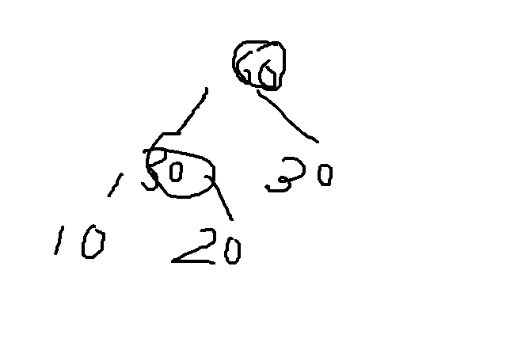

> 小顶堆来解决该问题

```java
	public static int lessMoney(int[] arr) {
		// 建立小顶堆
		PriorityQueue<Integer> queue = new PriorityQueue<Integer>(arr.length,(a,b)->(a-b));
		for(int i=0;i<arr.length;i++) {
			queue.offer(arr[i]);
		}
		int sum = 0;
		int cur = 0;
		while(queue.size()>1) {
			cur = queue.poll() + queue.poll();
			sum += cur;
			queue.add(cur);
		}
		return sum;
	}
```

## 题目三、项目收益

输入： 参数1，正数数组costs 参数2，正数数组profits 参数3， 正数k 参数4，正数m costs[i]表示i号项目的花费 profits[i]表示i号项目在扣除花 费之后还能挣到的钱(利润) k表示你不能并行、只能串行的最多 做k个项目 m表示你初始的资金 说明：你每做完一个项目，马上获得的收益，可以支持你去做下 一个 项目。 输出： 你最后获得的最大钱数

> 小顶堆来存储花费，大顶堆来存储利润

```java
// 构建一个结点
	public class Node{
		public int p;
		public int c;
		public Node(int p,int c) {
			this.p = p;
			this.c = c;
		}
	}
	
	public  int findMaximizedCapital(int k,int W,int[] profits,int[] capital) {
		// 构建项目
		Node[] nodes = new Node[profits.length];
		for(int i=0;i<profits.length;i++) {
			nodes[i] = new Node(profits[i],capital[i]);
		}
		// 小顶堆的花费
		PriorityQueue<Node> minCostQ = new PriorityQueue<Node>(nodes.length,(a,b)->(a.c-b.c));
		// 大顶堆的利润
		PriorityQueue<Node> maxProfitQ = new PriorityQueue<Node>(nodes.length,(a,b)->(b.p-a.p));
		
		for(int i=0;i<nodes.length;i++) {
			minCostQ.offer(nodes[i]);
		}
		
		while(!minCostQ.isEmpty()&&minCostQ.peek().c<=W) {
			maxProfitQ.add(minCostQ.poll());
		}
		if(maxProfitQ.isEmpty()) {
			return W;
		}
		for(int i=0;i<k;i++) {
			W += maxProfitQ.poll().p;
		}
		return W;
	}
```

## 题目四、随时获取数据流中的中位数

**题目：**

　　有一个源源不断地吐出整数的数据流，假设你有足够的空间来保存吐出的数，请设计一个名叫MedianHolder的结构，使其能随时取得之前吐出所有数的中位数

**思路：**

　　创建两个堆，一个大根堆，一个小根堆，大根堆放较小的一半数，小根堆放较大的一半数。

**步骤：**

- 1.第一个数放大根堆
- 2.新出现的数cur,判断与大根堆堆顶的大小，比它小进大根堆，比它大，进小根堆。
- 3.使两堆平衡（借助平衡二叉树思想，左右差1），超过1，取堆顶节点扔到对面去

```java
public class Code_MedianHolder {
	
	PriorityQueue<Integer> maxHeap;
	PriorityQueue<Integer> minHeap;
	
	public Code_MedianHolder() {
		maxHeap = new PriorityQueue<Integer>((a,b)->(b-a));
		minHeap = new PriorityQueue<Integer>((a,b)->(a-b));
	}
	
	// 调整不超过1
	private void modifyHeap() {
		if(maxHeap.size()>minHeap.size()+1) {
			minHeap.add(maxHeap.poll());
		}
		if(minHeap.size()>maxHeap.size()+1) {
			maxHeap.add(minHeap.poll());
		}
	}
	
	// 添加
	public void addNumber(Integer num) {
		if(maxHeap.isEmpty()||maxHeap.peek()>=num) {
			maxHeap.add(num);
		}else {
			minHeap.add(num);
		}
		modifyHeap();
	}
	
	// 获取中位数
	public Integer getMidian() {
		if(maxHeap==null) {
			return null;
		}
		if(maxHeap.size()==minHeap.size()) {
			return (maxHeap.peek()+minHeap.peek())>>1;
		}else if(maxHeap.size()>minHeap.size()) {
			return maxHeap.peek();
		}else {
			return minHeap.peek();
		}
	}
}

```

## 题目五、字符串拼接

给定一个字符串类型的数组strs，找到一种拼接方式，使得把所有字符串拼起来之后形成的字符串具有最低的字典序。

```java
public class Code_LowestLexicography {
	// 拼接字符串
	public static String lowestString(String[] strs) {
		if(strs==null || strs.length==0) {
			return "";
		}
		Arrays.sort(strs,(a,b)->((a+b).compareTo(b+a)));
		String res = "";
		for(int i=0;i<strs.length;i++) {
			res += strs[i];
		}
		return res;
	}
}
```

## 题目六、会议室问题

一些项目要占用一个会议室宣讲，会议室不能同时容纳两个项目 的宣讲。 给你每一个项目开始的时间和结束的时间(给你一个数 组，里面 是一个个具体的项目)，你来安排宣讲的日程，要求会 议室进行 的宣讲的场次最多。返回这个最多的宣讲场次。

```
public class Code_BestArrange {
	// 每个项目的开始和结束时间
	public static class Program{
		private int start;
		private int end;
		public Program(int start,int end) {
			this.start = start;
			this.end   = end;
		}
	}
	
	public static int bestArrange(Program[] programs,int start) {
		Arrays.sort(programs,(a,b)->(a.end-b.end));
		int result = 0;
		for(int i=0;i<programs.length;i++) {
			if(start<=programs[i].start) {
				result++;
				start = programs[i].end;
			}
		}
		return result;
	}
}

```

# 递归、动态规划

暴力递归:

- 1.把问题转化为规模缩小了的同类问题的子问题
- 2.有明确的不需要继续进行递归的条件
- 3.有当得到了子问题的结果之后的决策过程4，不记录每一个子问题的解


动态规划：

- 1.从暴力递归中来
- 2.把每一个子问题解记录下来，避免重复计算
- 3.把暴力递归的过程，抽象成了状态表达
- 4.并且存在化简状态表达，使其更加简洁的可能


## 题目一、求n！的结果

```java
	public long factorial(int n) {
		if(n==1) {
			return 1L;
		}
		return (long)n*factorial(n-1);
	}
```


## 题目二、汉诺塔问题

打印n层汉诺塔层左边移动到最右边的全部过程

```java
public static void hanoi(int n) {
		if(n>0) {
			process(n,n,"left","mid","right");
		}
	}
	public static void process(int rest,int down,String from,String help,String to) {
		if(rest==1) {
			System.out.println("move " + down + " from " + from + " to" + to);
		}else {
			process(rest-1, down-1, from, to, help);
			process(1, down, from, help, to);
			process(rest-1, down-1, help, from, to);
		}
	}
```

## 题目三、字符串的全部子序列

```java
	public static void printAllSequences(String str) {
		char[] chs = str.toCharArray();
		String res = "";
		process(chs,0,res);
	}
	
	public static void process(char[] chs,int i,String res) {
		// 截止条件
		if(i==chs.length) {
			System.out.println(res);
			return;
		}
		process(chs, i+1, res);
		process(chs, i+1, res + String.valueOf(chs[i]));
	}
	
	public static void main(String[] args) {
		String test = "abc";
		printAllSequences(test);
	}
```

## 题目四、字符串的全排列

打印一个字符串的全部排列

```java
public static void printAllPermutations(String test) {
		char[] chs = test.toCharArray();
		String res = "";
		process(chs,0,res);
	}
	
	public static void process(char[] chs,int i,String res) {
		// 截止条件
		if(i==chs.length) {
			System.out.println(res);
			return;
		}
		for(int j=i;j<chs.length;j++) {
			swap(chs,i,j);
			process(chs, i+1, res+String.valueOf(chs[i]));
			swap(chs,i,j);
		}
	}
	// 交换
	public static void swap(char[] chs,int i,int j) {
		char temp = chs[i];
		chs[i] = chs[j];
		chs[j] = temp;
	}
	
	// 主函数
	public static void main(String[] args) {
		String test = "abc";
		printAllPermutations(test);
	}
	
```

abc
acb
cab
cba
bac

bac

但存在重复的排列

```java
public static void printAllPermutations(String test) {
		char[] chs = test.toCharArray();
		String res = "";
		process(chs,0,res);
	}
	
	public static void process(char[] chs,int i,String res) {
		// 截止条件
		if(i==chs.length) {
			System.out.println(res);
			return;
		}
		HashSet<Character> set =  new HashSet<Character>();
		
		for(int j=i;j<chs.length;j++) {
			if(!set.contains(chs[j])) {
				set.add(chs[j]);
				swap(chs,i,j);
				process(chs, i+1, res+String.valueOf(chs[i]));
				swap(chs,i,j);
			}
			
		}
	}
	// 交换
	public static void swap(char[] chs,int i,int j) {
		char temp = chs[i];
		chs[i] = chs[j];
		chs[j] = temp;
	}
	
	// 主函数
	public static void main(String[] args) {
		String test = "abda";
		printAllPermutations(test);
	}
```

## 题目五、母牛问题

母牛每年生一只母牛，新出生的母牛成长三年后也能每年生一只 母牛，假设不会死。求N年后，母牛的数量。

```java
public static int cowNumber1(int n) {
		if (n < 1) {
			return 0;
		}
		if (n == 1 || n == 2 || n == 3) {
			return n;
		}
		return cowNumber1(n - 1) + cowNumber1(n - 3);
	}
```

## 题目六、逆序栈

给你一个栈，请你逆序这个栈，不能申请额外的数据结构，只能 使用递归函数。如何实现？

```java
public static void reverse(Stack<Integer> stack) {
		if (stack.isEmpty()) {
			return;
		}
		int i = getAndRemoveLastElement(stack);
		reverse(stack);
		stack.push(i);
	}

	public static int getAndRemoveLastElement(Stack<Integer> stack) {
		int result = stack.pop();
		if (stack.isEmpty()) {
			return result;
		} else {
			int last = getAndRemoveLastElement(stack);
			stack.push(result);
			return last;
		}
	}
```

## 题目七、最小路径和

给你一个二维数组，二维数组中的每个数都是正数，要求从左上 角走到右下角，每一步只能向右或者向下。沿途经过的数字要累 加起来。返回最小的路径和。

```java
public static int minPath(int[][] matrix) {
		return process(matrix,matrix.length-1,matrix[0].length-1);
	}
	public static int process(int[][] matrix,int i,int j) {
		int res = matrix[i][j];
		if(i==0&&j==0) {
			return res;
		}
		if(i==0&&j!=0) {
			return res+process(matrix, i, j-1);
		}
		if(i!=0&&j==0) {
			return res+process(matrix, i-1, j);
		}
		return res+Math.min(process(matrix, i, j-1), process(matrix, i-1, j));
	}
```

## 题目八、数组中累加和是否相等

给你一个数组arr，和一个整数aim。如果可以任意选择arr中的 数字，能不能累加得到aim，返回true或者false

```java
public static boolean sum(int[] arr,int aim) {
		return process(arr,0,0,aim);
	}
	public static boolean process(int[] arr,int i,int sum,int aim) {
		if(sum==aim) {
			return true;
		}
		if(i==arr.length) {
			return false;
		}
		return process(arr, i+1, sum, aim) || process(arr, i+1, sum+arr[i], aim);
	}
```


## 题目九、背包问题

给定两个数组w和v，两个数组长度相等，w[i]表示第i件商品的 重量，v[i]表示第i件商品的价值。 再给定一个整数bag，要求 你挑选商品的重量加起来一定不能超 过bag，返回满足这个条件 下，你能获得的最大价值。

```java
public static int process1(int[] weights, int[] values, int i, int alreadyweight, int bag) {
		if (alreadyweight > bag) {
			return Integer.MIN_VALUE;
		}
		if (i == weights.length) {
			return 0;
		}
		return Math.max(
				
				process1(weights, values, i + 1, alreadyweight, bag),
				
				values[i] + process1(weights, values, i + 1, alreadyweight + weights[i], bag));
	}

```


```JAVA
public static int maxValue2(int[] c, int[] p, int bag) {
		int[][] dp = new int[c.length + 1][bag + 1];
		for (int i = c.length - 1; i >= 0; i--) {
			for (int j = bag; j >= 0; j--) {
				dp[i][j] = dp[i + 1][j];
				if (j + c[i] <= bag) {
					dp[i][j] = Math.max(dp[i][j], p[i] + dp[i + 1][j + c[i]]);
				}
			}
		}
		return dp[0][0];
	}
```

